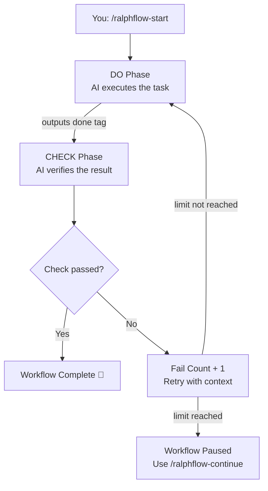
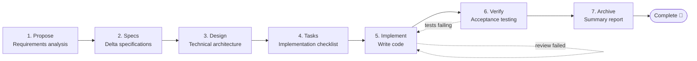
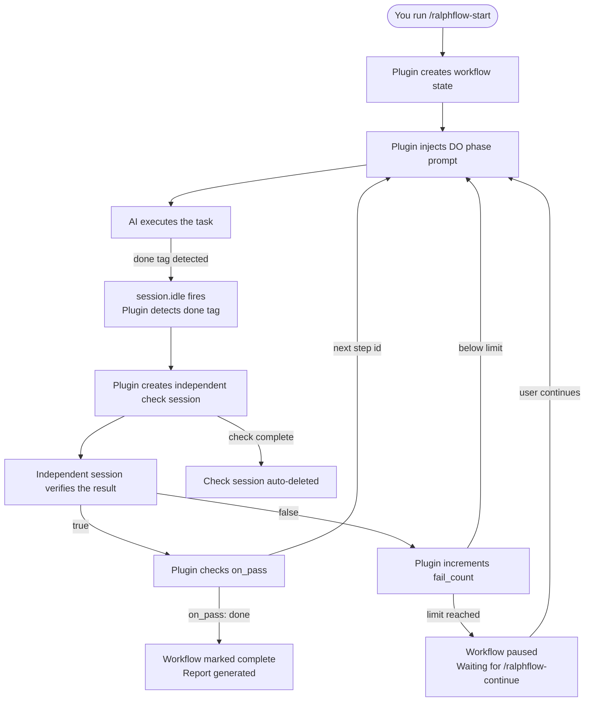
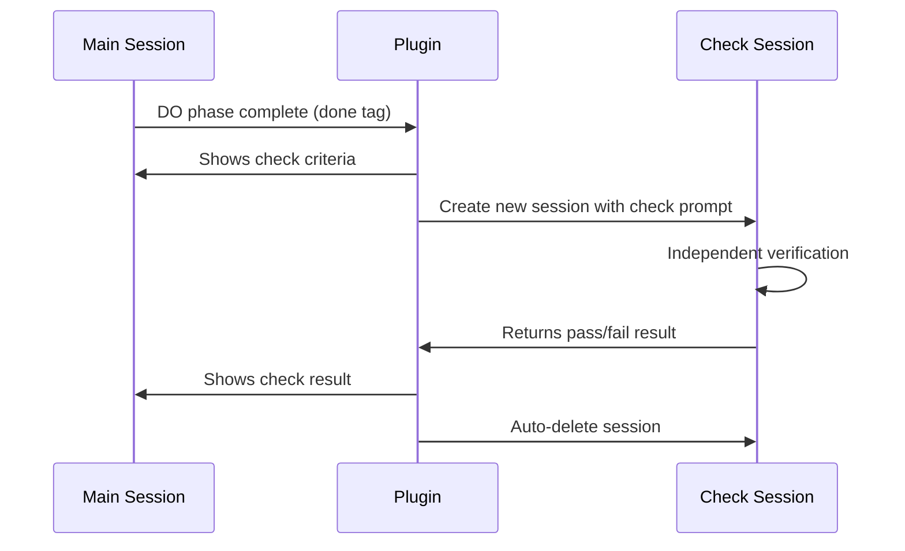

<div align="center">

# ralph-flow

**Workflow automation plugin for [opencode](https://opencode.ai)**

Turn complex development tasks into automated, multi-step pipelines — with built-in execution, verification, and retry.

[](LICENSE)
[](https://opencode.ai)

[English](README.md) · [中文](README_CN.md)

</div>

---

## ✨ Features

- **Multi-step pipelines** — define sequences of steps, each with an execution and verification phase
- **Independent session verification** — check phase runs in a separate session, preventing self-review bias and ensuring strict verification
- **Auto-retry with context** — failed steps retry with failure context; pause and resume at any limit
- **YAML-defined workflows** — create custom workflows with zero code; just a `.yaml` file
- **Built-in workflows** — `loop` for open-ended tasks, `spec` for structured spec-driven development
- **Execution logs & reports** — JSON Lines logging, per-step traces, and final completion reports
- **Zero manual wiring** — install once, workflows auto-register as slash commands

---

## 📦 Installation

The plugin is published on npm:

```json
{
  "plugin": ["@yibener/ralph-flow"]
}
```

Or clone locally for development:

```bash
git clone https://github.com/534529531/ralph-flow.git ~/.config/opencode/plugins/ralph-flow
cd ~/.config/opencode/plugins/ralph-flow
npm install
npm run build
```

Then reference the built module directly in your opencode config:

```json
{
  "plugin": ["file:///home/user/.config/opencode/plugins/ralph-flow/dist/index.js"]
}
```

Or create a bridge file in your plugins directory:

```ts
export { default } from "./ralph-flow/dist/index.js";
```

> On first load, the plugin auto-creates the workflow directory and its dependencies. No manual setup needed.

---

## 🚀 Quick Start

Start a workflow with automatic execution:

```
/ralphflow-start
```

The AI will prompt you to choose a workflow and describe your task. Or specify everything at once:

```
/ralphflow-start loop "Build a user authentication module with JWT and refresh tokens"
```

During execution, manage the workflow with these commands:

| Command                  | What it does                          |
| ------------------------ | ------------------------------------- |
| `/ralphflow-status`      | Show current step, phase, fail count  |
| `/ralphflow-continue`    | Resume a paused workflow              |
| `/ralphflow-cancel`      | Cancel and generate a summary report  |
| `/ralphflow-list`        | List all available workflows          |

---

## 📋 Built-in Workflows

### loop — Auto-loop execution

> **Best for**: open-ended tasks, bug fixes, feature development where the scope is clear.

A single-step workflow that keeps executing until all requirements are satisfied. Each cycle runs DO → CHECK, passing only when review criteria are met.

```yaml
# workflows/loop.yaml (built-in)
steps:
  - id: loop
    desc: Auto-loop task execution
    do: Execute the user-defined task and keep working until complete
    check: Strict review mode with independent audit and tool verification
    on_pass: done
    on_fail: loop
    max_fail_count: 100
```

<details>
<summary>How it works</summary>



</details>

---

### spec — Spec-driven development pipeline

> **Best for**: structured feature work that benefits from requirements → design → implementation.

Inspired by [OpenSpec's OPSX workflow](https://github.com/Fission-AI/OpenSpec), this pipeline walks through seven steps — from proposal to archive. Each step produces an artifact that feeds the next, with automated verification at every gate.



**Artifacts produced:**

| Step    | Artifact                          | Purpose                          |
| ------- | --------------------------------- | -------------------------------- |
| Propose | `.opencode/ralph-flow/artifacts/proposal.md`   | Why, what, scope, acceptance criteria    |
| Specs   | `.opencode/ralph-flow/artifacts/specs.md`      | Delta specs (ADDED / MODIFIED / REMOVED) |
| Design  | `.opencode/ralph-flow/artifacts/design.md`     | Architecture, data flow, file list       |
| Tasks   | `.opencode/ralph-flow/artifacts/tasks.md`      | Checkbox task list                       |
| Implement | — (code changes)                              | Task-by-task implementation              |
| Verify  | `.opencode/ralph-flow/artifacts/verification.md` | Acceptance report                     |
| Archive | `.opencode/ralph-flow/artifacts/summary.md`    | Change log summary                       |

---

## 🛠️ Custom Workflows

Create your own workflow by placing a `.yaml` file in `.opencode/ralph-flow/workflows/`.

### Structure

```yaml
manual_step:                     # Optional: comma-separated step IDs to require manual continuation

steps:
  - id: analyze
    desc: Task Analysis
    do: Analyze requirements and produce a design document
    input: User requirements
    output: design.md
    check: Verify the design is complete and technically sound
    on_pass: execute              # Next step when check passes
    on_fail: analyze              # Next step when check fails
    max_fail_count: 3

  - id: execute
    desc: Implementation
    do: Implement the design
    input: design.md
    output: Working code
    check: Run tests and verify implementation
    on_pass: done
    on_fail: execute
    max_fail_count: 5
```

### Step fields

| Field            | Required | Description                                    |
| ---------------- | -------- | ---------------------------------------------- |
| `id`             | ✅        | Unique step identifier                         |
| `desc`           | ✅        | Human-readable description                     |
| `do`             | ✅        | Task prompt (what the AI should do)            |
| `input`          | ✅        | Expected inputs                                |
| `output`         | ✅        | Expected outputs                               |
| `check`          | ✅        | Verification criteria prompt                   |
| `on_pass`        | ✅        | Next step id on success, or `"done"` to finish |
| `on_fail`        | ✅        | Next step id on failure                        |
| `max_fail_count` | ✅        | Max failures before pausing (per step)         |

### Completion tags

The AI signals completion using XML-like tags:

| Phase | Tag                                       | Meaning       |
| ----- | ----------------------------------------- | ------------- |
| DO    | `<promise>done</promise>`                 | Task finished |
| CHECK | `<promise-check>true</promise-check>`     | Passed        |
| CHECK | `<promise-check>false</promise-check>`    | Failed        |

> Tags are case-insensitive and allow whitespace. `<promise>DONE</promise>` works.

### Manual steps

Add step IDs to the `manual_step` list to require user action before proceeding:

```yaml
manual_step: analyze, execute
```

Steps in this list will **not** auto-continue when the session is idle — the AI waits for your input.

---

## ⚙️ How It Works

### Core cycle



### Independent session verification

The CHECK phase uses an **independent session** to verify task completion, preventing self-review bias:



**Why independent sessions?**
- **No self-review bias** — the checker has no memory of the implementation process
- **Strict verification** — checks against criteria only, not against what the AI "intended" to do
- **Clean context** — no accumulated context that could influence the judgment

**Check session permissions:**

The CHECK phase uses the `ralph-check` agent by default, with the following permissions:

| Permission | Config | Description |
|------------|--------|-------------|
| `edit` | `deny` | Prevents the checker from modifying code |
| `bash` | `allow` | Allows running verification commands (tests, file checks, etc.) |

The plugin automatically registers the `ralph-check` agent on startup — no manual configuration needed. To override, specify in your workflow YAML:

```yaml
adversarial_check:
  agent: "build"  # Use a different agent
```

**What the user sees:**
- Check criteria displayed in the main session before verification begins
- Check result (pass/fail with reasons) injected back into the main session
- Failure context included when retrying the DO phase

### Multi-step flow

When a check passes, the plugin reads `on_pass` and transitions to the next step's DO phase. When it fails, the plugin reads `on_fail` — either retrying the same step (with failure context) or jumping to a recovery step.

### Session events

The plugin hooks into `session.idle` to detect completion tags and drive the workflow forward automatically. `session.deleted` marks the workflow as paused so you can resume later.

---

## 📁 File Structure

All generated files are scoped under `.opencode/ralph-flow/`:

```
.opencode/
└── ralph-flow/                    # Plugin root
    ├── ralph-flow.local.md        # Workflow state (markdown frontmatter)
    ├── workflows/                 # Custom workflow YAML definitions
    │   ├── loop.yaml              # Built-in: auto-loop
    │   └── spec.yaml              # Built-in: spec-driven pipeline
    ├── artifacts/                 # Generated by spec workflow
    │   ├── proposal.md
    │   ├── specs.md
    │   ├── design.md
    │   ├── tasks.md
    │   ├── verification.md
    │   └── summary.md
    ├── logs/                      # Execution logs (JSON Lines)
    │   ├── execution.log
    │   ├── step-*.log
    │   └── final-report.md
    └── package.json               # Auto-managed dependencies
```

---

## 📟 Command Reference

| Slash Command           | Tool                      | Description                    |
| ----------------------- | ------------------------- | ------------------------------ |
| `/ralphflow-start`      | `ralphflow-start`         | Start a workflow               |
| `/ralphflow-continue`   | `ralphflow-continue`      | Resume a paused workflow       |
| `/ralphflow-cancel`     | `ralphflow-cancel`        | Cancel and generate report     |
| `/ralphflow-status`     | `ralphflow-status`        | Show current workflow state    |
| `/ralphflow-list`       | `ralphflow-list`          | List available workflows       |

### Log events

Events are logged to `.opencode/ralph-flow/logs/execution.log` in JSON Lines format:

| Event                  | Description                            |
| ---------------------- | -------------------------------------- |
| `workflow_start`       | Workflow started                       |
| `workflow_end`         | Workflow completed                     |
| `step_start`           | Step phase started                     |
| `done_detected`        | `<promise>done</promise>` detected     |
| `check_result`         | Check result (true / false)            |
| `fail_count_increment` | Failure count increased                |
| `workflow_paused`      | Paused (max failures reached)          |
| `workflow_resumed`     | Resumed by user                        |
| `workflow_cancelled`   | Cancelled by user                      |

---

## 📝 License

MIT — see [LICENSE](LICENSE).

---

<div align="center">

**Built for [opencode](https://opencode.ai)** · [Report issue](https://github.com/534529531/ralph-flow/issues)

</div>
