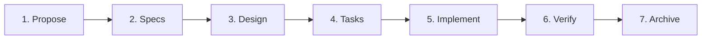
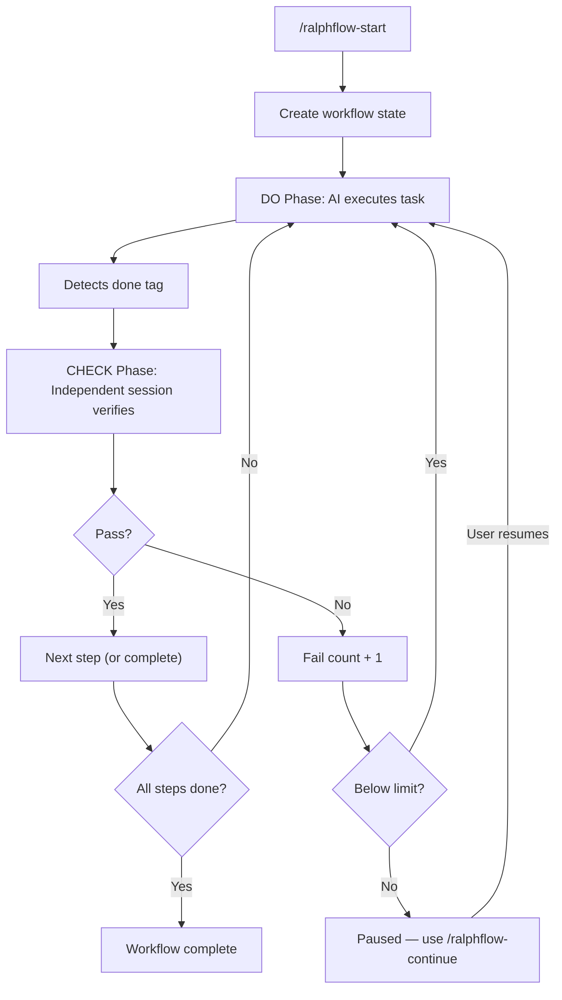

<div align="center">

# ralph-flow

**Workflow automation plugin for [opencode](https://opencode.ai)**

Make AI actually follow complex workflows — execute, verify, retry until done.

[](LICENSE)
[](https://opencode.ai)

[English](README.md) · [中文](README_CN.md)

</div>

---

## The Problem

You tell an AI: "Implement user auth, write tests, update docs, and make sure all tests pass."

What actually happens:
- AI writes some code and stops
- Tests are never run
- Docs are forgotten
- No verification that anything actually works

**Even when you ask AI to verify itself, it fails:**
- The AI is both player and referee — it lowers the bar for its own work
- It's overconfident — "looks good to me" without actually checking
- It blames external factors — "the test environment is broken", "existing code has issues", "dependencies are outdated"

**AI doesn't follow multi-step workflows.** It loses context, skips steps, and never truly verifies its own work.

## The Solution

ralph-flow forces AI to follow structured workflows with **independent verification at every step**. It's not just prompt engineering — it's a state machine that won't let the AI skip steps or claim "done" without proof.

---

## ralph-flow vs ralph-loop

| | ralph-loop | ralph-flow |
|---|---|---|
| **Type** | Prompt technique | opencode plugin |
| **How it works** | Instructions in system prompt | Event-driven state machine |
| **Verification** | Self-review (biased) | Independent session (unbiased) |
| **Multi-step** | Single loop | Multi-step pipelines with branching |
| **State management** | None | Full state tracking, pause/resume |
| **Failure handling** | Retry blindly | Retry with failure context |
| **Logging** | None | JSON Lines execution logs |
| **Setup** | Copy prompt to AGENTS.md | Install plugin, auto-registers commands |

**ralph-flow is the evolution of ralph-loop** — same core idea (execute → verify → retry), but built as a proper plugin with state management, independent verification, and multi-step support.

---

## Built-in Workflows

### loop — Auto-loop execution

> Based on [opencode-ralph-loop](https://github.com/charfeng1/opencode-ralph-loop)

> **Best for**: open-ended tasks, bug fixes, feature development where the scope is clear.

A single-step workflow that keeps executing until all requirements are satisfied. Each cycle runs DO → CHECK, passing only when review criteria are met.

```
/ralphflow-start loop "Build a user authentication module with JWT and refresh tokens"
```

```yaml
# workflows/loop.yaml (built-in)
steps:
  - id: loop
    desc: Auto-loop task execution
    do: Execute the user-defined task, implement each requirement one by one
    check: Verify from four dimensions: completeness, correctness, quality, and verifiability
    on_pass: done
    on_fail: loop
    max_fail_count: 100
```

### spec — Spec-driven development pipeline

> Based on [OpenSpec](https://github.com/Fission-AI/OpenSpec)

> **Best for**: structured feature work that benefits from requirements → design → implementation.

A seven-step pipeline from proposal to archive. Each step produces an artifact that feeds the next, with automated verification at every gate.

```
/ralphflow-start spec "Add user authentication with OAuth2 support"
```



---

## How It Works



The CHECK phase uses a **separate AI session** with no memory of the implementation — it judges strictly against criteria, not against what the AI "intended" to do.

---

## ✨ Features

- 🔄 **Auto-loop with failure context** — retries carry failure reasons so AI learns from mistakes (up to 100 attempts)
- 🔍 **Independent verification** — separate check session prevents self-review bias; configure which agent to use via `adversarial_check.agent`
- 📦 **Natural language YAML** — `do`, `check`, `input`, `output` are all plain English descriptions, no DSL to learn
- 🔀 **Branching & recovery** — route failures to specific steps (`on_fail: fix-build`), not just retry blindly
- 🛠️ **Fully customizable** — copy any built-in workflow and modify it; add your own steps, change verification criteria
- 📊 **Execution logs** — JSON Lines logging with per-step traces and final reports

---

## 📦 Installation

Add to your opencode config (`~/.config/opencode/opencode.json` for global, or `opencode.json` in project root):

```json
{
  "plugin": ["@yibener/ralph-flow"]
}
```

Or clone locally:

```bash
git clone https://github.com/534529531/ralph-flow.git ~/.config/opencode/plugins/ralph-flow
cd ~/.config/opencode/plugins/ralph-flow
npm install && npm run build
```

> On first load, the plugin auto-creates the workflow directory and dependencies.

---

## 🚀 Quick Start

```
/ralphflow-start loop "Build a user authentication module with JWT and refresh tokens"
```

| Command | What it does |
|---------|--------------|
| `/ralphflow-status` | Show current step, phase, fail count |
| `/ralphflow-continue` | Resume a paused workflow |
| `/ralphflow-cancel` | Cancel and generate summary report |
| `/ralphflow-list` | List all available workflows |

---

## 🛠️ Custom Workflows

Place a `.yaml` file in `.opencode/ralph-flow/workflows/`:

```yaml
steps:
  - id: analyze
    desc: Task Analysis
    do: Analyze requirements and produce a design document
    input: User requirements
    output: design.md
    check: Verify the design is complete and technically sound
    on_pass: execute
    on_fail: analyze
    max_fail_count: 3

  - id: execute
    desc: Implementation
    do: Implement the design
    input: design.md
    output: Working code
    check: Run tests and verify implementation
    on_pass: done
    on_fail: execute
    max_fail_count: 5
```

**Completion tags:** `<promise>done</promise>`, `<promise-check>true/false</promise-check>`

See [Custom Workflows Guide](docs/custom-workflows.md) for branching, recovery, and advanced patterns.

---

## 📚 Documentation

| Topic | Description |
|-------|-------------|
| [Documentation Home](docs/README.md) | Start here for guided reading order |
| [Custom Workflows](docs/custom-workflows.md) | Create workflows, configure verification, nesting |
| [How It Works](docs/how-it-works.md) | Architecture, events, state, file structure |
| [Commands Reference](docs/commands.md) | All commands and log events |

---

## 📝 License

MIT — see [LICENSE](LICENSE).

---

<div align="center">

**Built for [opencode](https://opencode.ai)** · [Report issue](https://github.com/534529531/ralph-flow/issues)

</div>
