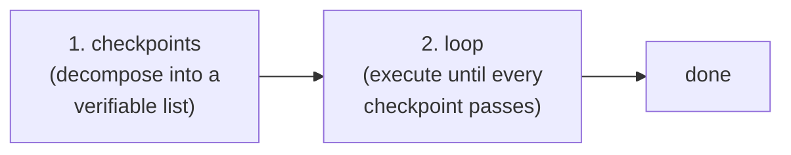
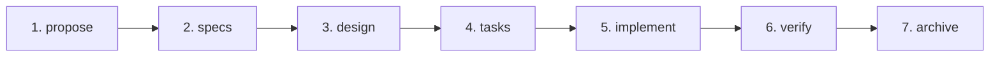
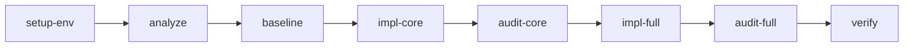
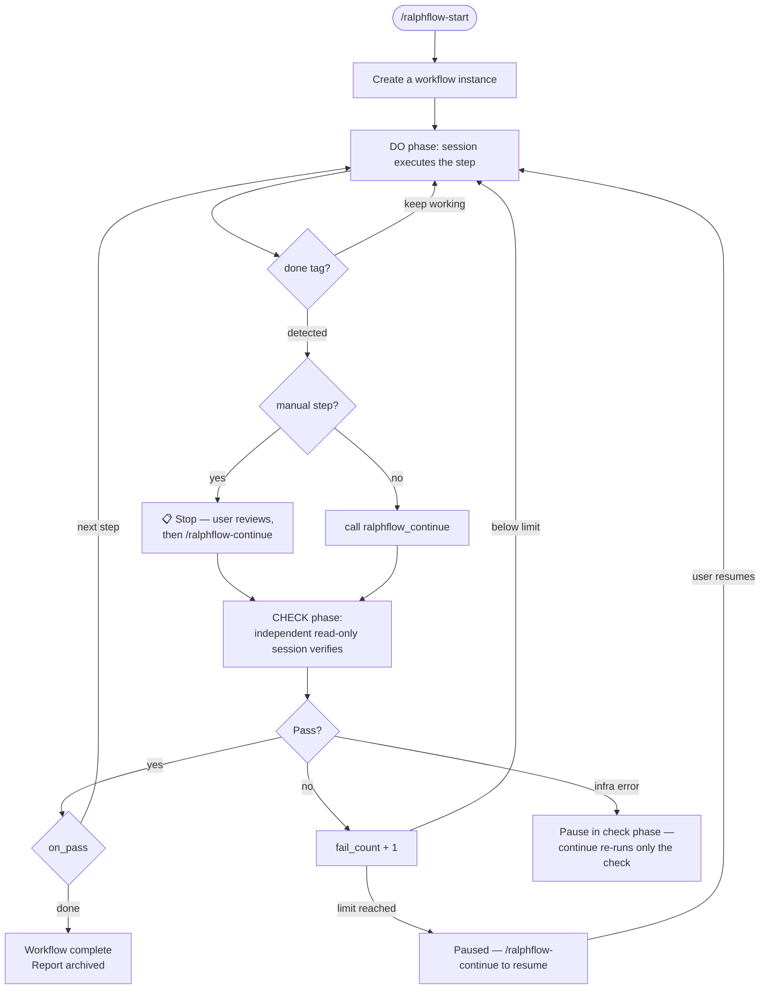

<div align="center">

# ralph-flow

**Workflow automation plugin for [opencode](https://opencode.ai)**

Make AI actually follow complex workflows — execute, verify, retry until done.

[](LICENSE)
[](https://opencode.ai)

[English](README.md) · [中文](README_CN.md)

</div>

---

## The Problem

You tell an AI: "Implement user auth, write tests, update docs, and make sure all tests pass."

What actually happens:
- AI writes some code and stops
- Tests are never run
- Docs are forgotten
- No verification that anything actually works

**Even when you ask AI to verify itself, it fails:**
- The AI is both player and referee — it lowers the bar for its own work
- It's overconfident — "looks good to me" without actually checking
- It blames external factors — "the test environment is broken", "existing code has issues", "dependencies are outdated"

**AI doesn't follow multi-step workflows.** It loses context, skips steps, and never truly verifies its own work.

## The Solution

ralph-flow forces AI to follow structured workflows with **independent verification at every step**. It's not just prompt engineering — it's a state machine that won't let the AI skip steps or claim "done" without proof.

Each step runs two phases:

- **DO** — the working session executes the task and ends with a `<promise>done</promise>` tag
- **CHECK** — an **independent session** (a read-only verifier that saw none of the DO conversation) re-verifies the work against the step's criteria

Pass → next step. Fail → retry, carrying the failure reason. Too many failures → pause for you.

---

## ralph-flow vs ralph-loop

| | ralph-loop | ralph-flow |
|---|---|---|
| **Type** | Prompt technique | opencode plugin |
| **How it works** | Instructions in system prompt | Event-driven state machine |
| **Verification** | Self-review (biased) | Independent session (unbiased) |
| **Multi-step** | Single loop | Multi-step pipelines with branching |
| **State management** | None | Full state tracking, pause/resume, takeover |
| **Parallelism** | One at a time | One instance per session, in parallel |
| **Failure handling** | Retry blindly | Retry with failure context |
| **Human gates** | None | `manual_step` review before verification |
| **Logging** | None | JSON Lines execution logs + reports |
| **Setup** | Copy prompt to AGENTS.md | Install plugin, auto-registers commands |

**ralph-flow is the evolution of ralph-loop** — same core idea (execute → verify → retry), built as a proper plugin with state management, independent verification, and multi-step support.

---

## Built-in Workflows

### loop — Auto-loop execution

> Based on [opencode-ralph-loop](https://github.com/charfeng1/opencode-ralph-loop)

> **Best for**: open-ended tasks, bug fixes, feature development where the scope is clear.

Decomposes your request into a verifiable checkpoint list, then keeps executing until every checkpoint passes. Each cycle runs DO → CHECK, passing only when the review criteria are met.

```
/ralphflow-start loop "Build a user authentication module with JWT and refresh tokens"
```


```mermaid
flowchart LR
    C["1. checkpoints<br/>(decompose into a<br/>verifiable list)"] --> L["2. loop<br/>(execute until every<br/>checkpoint passes)"]
    L --> Done["done"]
```

### spec — Spec-driven development pipeline

> Based on [OpenSpec](https://github.com/Fission-AI/OpenSpec)

> **Best for**: structured feature work that benefits from requirements → design → implementation.

A seven-step pipeline from proposal to archive. Each step produces an artifact that feeds the next, with independent verification at every gate.

```
/ralphflow-start spec "Add user authentication with OAuth2 support"
```


```mermaid
flowchart LR
    P["1. propose"] --> S["2. specs"]
    S --> D["3. design"]
    D --> T["4. tasks"]
    T --> I["5. implement"]
    I --> V["6. verify"]
    V --> A["7. archive"]
```

### c-to-rust — C → idiomatic safe Rust

> **Best for**: migrating a C project to a Rust binary, module by module, with a TDD safety net and `unsafe` kept under 10%.

Nine steps: probe the project, port the tests as a red baseline, translate core then full modules, audit each pass independently, and gate on a final QA verification.

```
/ralphflow-start c-to-rust "Port this C parser to Rust"
```


```mermaid
flowchart LR
    E["setup-env"] --> A["analyze"] --> B["baseline"]
    B --> IC["impl-core"] --> AC["audit-core"]
    AC --> IF["impl-full"] --> AF["audit-full"] --> V["verify"]
```

### everything2rust — any language → Rust

> **Best for**: rewriting a system written in *any* language to Rust with behavioral equivalence, driven by golden corpora and ADRs.

Eleven steps: survey the source system and run it for real, capture a behavior spec + golden corpus, design with recorded decisions (a **manual review gate** on `design`), then TDD-implement, audit, and verify.

```
/ralphflow-start everything2rust "Rewrite this Python CLI in Rust"
```

The `c-to-rust` and `everything2rust` workflows drive 12 bundled skills (auto-synced into the global `~/.config/opencode/skills/`, so your project tree stays clean) covering planning, test generation, implementation patterns, auditing, and final validation.

---

## How It Works


```mermaid
flowchart TD
    Start(["/ralphflow-start"]) --> Inst["Create a workflow instance"]
    Inst --> DO["DO phase: session executes the step"]
    DO --> DoneTag{"done tag?"}
    DoneTag -->|"keep working"| DO
    DoneTag -->|"detected"| Manual{"manual step?"}
    Manual -->|"yes"| Review["📋 Stop — user reviews,<br/>then /ralphflow-continue"]
    Manual -->|"no"| Continue["call ralphflow_continue"]
    Review --> CHECK
    Continue --> CHECK["CHECK phase:<br/>independent read-only session verifies"]
    CHECK --> Pass{"Pass?"}
    Pass -->|"yes"| Next{"on_pass"}
    Pass -->|"no"| Fail["fail_count + 1"]
    Pass -->|"infra error"| Infra["Pause in check phase —<br/>continue re-runs only the check"]
    Next -->|"next step"| DO
    Next -->|"done"| Complete["Workflow complete<br/>Report archived"]
    Fail -->|"below limit"| DO
    Fail -->|"limit reached"| Pause["Paused — /ralphflow-continue to resume"]
    Pause -->|"user resumes"| DO
```

The CHECK phase uses a **separate session** with no memory of the implementation — it judges strictly against the criteria, not against what the AI "intended" to do. If verification itself can't run (API error, timeout), that's an infrastructure failure: it does **not** burn a retry — the workflow pauses in check phase and the next `/ralphflow-continue` re-runs only the verification.

---

## ✨ Features

- 🔄 **Auto-loop with failure context** — retries carry the verifier's exact failure reason so the AI fixes the real problem instead of repeating it
- 🔍 **Independent verification** — a separate read-only session prevents self-review bias; configure agent, model, timeout via `adversarial_check`
- 🧩 **Multi-instance** — every session runs its own workflow instance in the same project, in parallel, fully isolated
- 📋 **Human review gates** — `manual_step` stops the session after DO, before verification, so you review first
- 📦 **Natural language YAML** — `do`, `check`, `input`, `output` are plain descriptions, no DSL to learn
- 🔀 **Branching & recovery** — route failures to specific steps (`on_fail: fix-build`), not just blind retry
- 🪆 **Sub-workflows** — compose workflows from reusable parts (nesting to depth 5)
- 🩺 **Doctor & create** — `/ralphflow-doctor` diagnoses definitions, `/ralphflow-create` designs one with you
- 📊 **Execution logs & reports** — JSON Lines logging with per-step traces and archived final reports

---

## 📦 Installation

Add to your opencode config (`~/.config/opencode/opencode.json` for global, or `opencode.json` in project root):

```json
{
  "plugin": ["@yibener/ralph-flow"]
}
```

Or clone locally:

```bash
git clone https://github.com/534529531/ralph-flow.git ~/.config/opencode/plugins/ralph-flow
cd ~/.config/opencode/plugins/ralph-flow
npm install && npm run build
```

> On first load, the plugin registers its commands, the read-only `ralph-check` agent, and syncs its bundled skills into the global `~/.config/opencode/skills/` (not your project).

### Upgrading from 1.x

Pull and rebuild. On first startup 2.0 automatically migrates an interrupted 1.x workflow (`ralph-flow.local.md`) into the new multi-instance layout — reattach with `/ralphflow-continue`. Tool names changed from `ralphflow-start` to `ralphflow_start` (slash commands stay `/ralphflow-start`).

---

## 🚀 Quick Start

```
/ralphflow-start loop "Build a user authentication module with JWT and refresh tokens"
```

| Command | What it does |
|---------|--------------|
| `/ralphflow-status` | Show current step, phase, fail count (or all instances) |
| `/ralphflow-continue` | Approve a manual review · resume a paused workflow · attach to an interrupted instance |
| `/ralphflow-cancel` | Cancel and archive the final report |
| `/ralphflow-list` | List available workflows and active instances |
| `/ralphflow-doctor` | Diagnose all workflow definitions |
| `/ralphflow-create` | Interactively design a custom workflow |

---

## 🛠️ Custom Workflows

Drop a `.yaml` file in one of two places, or run `/ralphflow-create` to design and validate one interactively:

- `.opencode/ralph-flow/workflows/` — **this project only**
- `~/.config/opencode/ralph-flow/workflows/` — **global**, available in every project and untouched by plugin updates

Resolution order is **project → global → built-in**; a same-named workflow at an earlier tier shadows the later ones.

```yaml
description: Build, test, and document a feature

steps:
  - id: analyze
    desc: Task analysis
    do: Analyze the requirements and produce a design document.
    input: User requirements
    output: "design.md"
    check: Open design.md; verify it covers the data model, API surface, and error handling.
    on_pass: execute
    on_fail: analyze
    max_fail_count: 3

  - id: execute
    desc: Implementation
    do: Implement the design. Run the full test suite until it is green.
    input: design.md
    output: Working code with passing tests
    check: Run the test suite yourself; verify the code matches design.md.
    on_pass: done
    on_fail: execute
    max_fail_count: 5
```

> **Every normal step requires** `id`, `desc`, `do`, `check`, `input`, `output`, `on_pass`, `on_fail`, `max_fail_count`. A step missing any of these is **silently skipped** — run `/ralphflow-doctor` to catch that.

**Completion tags:** `<promise>done</promise>`, `<promise-check>true/false</promise-check>`

See the [Custom Workflows Guide](docs/custom-workflows.md) for branching, recovery, sub-workflows, and advanced patterns.

---

## 📚 Documentation

| Topic | Description |
|-------|-------------|
| [Documentation Home](docs/README.md) | Start here for a guided reading order |
| [Custom Workflows](docs/custom-workflows.md) | Create workflows, configure verification, nesting |
| [How It Works](docs/how-it-works.md) | Architecture, events, state, file structure |
| [Commands Reference](docs/commands.md) | All commands and log events |
| [SYNC.md](SYNC.md) | Structural mapping to the Claude Code sibling plugin |

---

## 📝 License

MIT — see [LICENSE](LICENSE).

---

<div align="center">

**Built for [opencode](https://opencode.ai)** · [Report issue](https://github.com/534529531/ralph-flow/issues)

</div>
