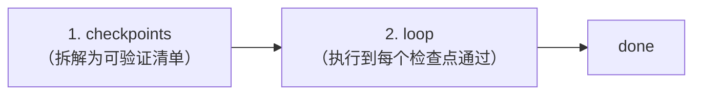
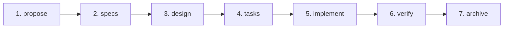
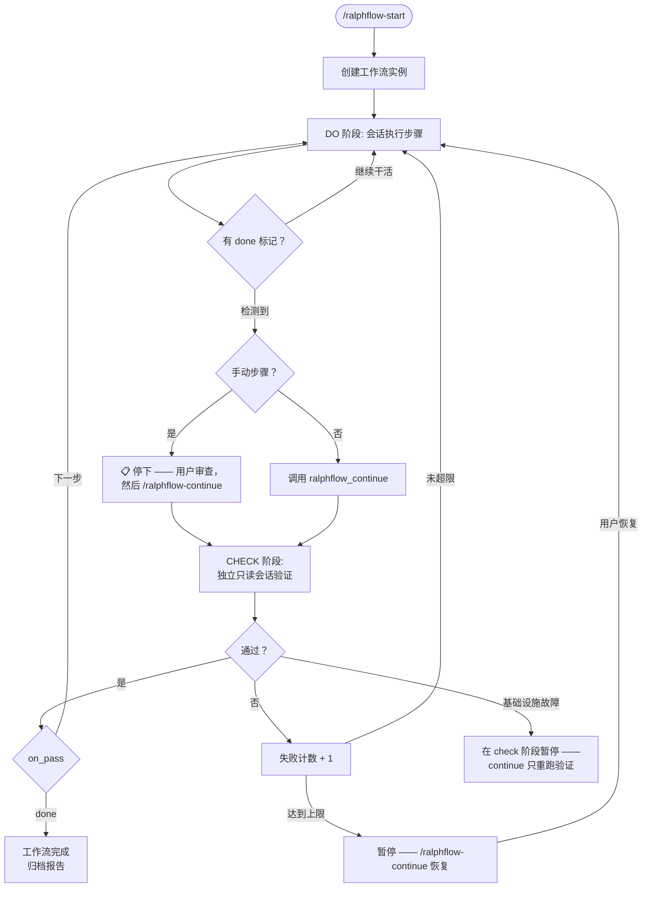

<div align="center">

# ralph-flow

**[opencode](https://opencode.ai) 工作流自动化插件**

让 AI 真正遵循复杂工作流 —— 执行、验证、重试，直到完成。

[](LICENSE)
[](https://opencode.ai)


</div>

---

## 问题

你对 AI 说："实现用户认证，写测试，更新文档，确保所有测试通过。"

实际发生的是：
- AI 写了点代码就停了
- 测试从来没跑过
- 文档被遗忘
- 没有任何验证

**即使你让 AI 自己验证，也不行：**
- AI 既当运动员又当裁判 —— 对自己的工作降低标准
- 过度自信 —— 没实际检查就说"看起来没问题"
- 甩锅外部因素 —— "测试环境坏了"、"现有代码有问题"、"依赖过时了"

**AI 不会遵循多步骤工作流。** 它丢上下文、跳步骤、从不真正验证自己的工作。

## 解决方案

ralph-flow 强制 AI 遵循结构化工作流，**每一步都有独立验证**。这不只是提示词工程 —— 而是一个状态机，不允许 AI 跳过步骤，也不允许没有证据就宣称"完成"。

每个步骤分两个阶段：

- **DO** —— 工作会话执行任务，最后一行输出 `<promise>done</promise>` 标记
- **CHECK** —— 一个**独立会话**（只读验证者，完全没看过 DO 阶段的对话）按步骤的检查依据重新验证

通过 → 下一步。失败 → 带着失败原因重试。失败太多次 → 暂停等你介入。

---

## ralph-flow vs ralph-loop

| | ralph-loop | ralph-flow |
|---|---|---|
| **类型** | 提示词技巧 | opencode 插件 |
| **工作方式** | 系统提示词中的指令 | 事件驱动的状态机 |
| **验证方式** | 自我审查（有偏差） | 独立会话（无偏差） |
| **多步骤** | 单循环 | 多步骤流水线，支持分支 |
| **状态管理** | 无 | 完整状态追踪，暂停/恢复，接管 |
| **并行** | 一次一个 | 每会话一个实例，可并行 |
| **失败处理** | 盲目重试 | 携带失败上下文重试 |
| **人工审查门** | 无 | `manual_step` 在验证前停下审查 |
| **日志** | 无 | JSON Lines 执行日志 + 报告 |
| **配置** | 复制提示词到 AGENTS.md | 安装插件，自动注册命令 |

**ralph-flow 是 ralph-loop 的进化版** —— 相同的核心理念（执行 → 验证 → 重试），但作为正式插件构建，具备状态管理、独立验证和多步骤支持。

---

## 内置工作流

### loop — 检查点驱动循环

> 基于 [opencode-ralph-loop](https://github.com/charfeng1/opencode-ralph-loop) 用工作流重新实现

> **适用场景**：开放式任务、Bug 修复、范围明确的功能开发。

先把你的需求拆解成可验证的检查点清单，再持续执行直到每个检查点通过。每轮执行 DO → CHECK 循环，满足审查标准才算通过。

```
/loop "用 JWT 和 refresh token 实现用户认证模块"
```


```mermaid
flowchart LR
    C["1. checkpoints<br/>（拆解为可验证清单）"] --> L["2. loop<br/>（执行到每个检查点通过）"]
    L --> Done["done"]
```

### spec — 规范驱动开发流水线

> 基于 [OpenSpec](https://github.com/Fission-AI/OpenSpec) 用工作流重新实现

> **适用场景**：需要需求 → 设计 → 实现的结构化功能开发。

七步流水线，从提议到归档。每一步产出构件后流入下一步，并在每个关口独立验证。

```
/spec "添加 OAuth2 用户认证功能"
```


```mermaid
flowchart LR
    P["1. propose"] --> S["2. specs"]
    S --> D["3. design"]
    D --> T["4. tasks"]
    T --> I["5. implement"]
    I --> V["6. verify"]
    V --> A["7. archive"]
```

---

## 工作原理


```mermaid
flowchart TD
    Start(["/ralphflow-start"]) --> Inst["创建工作流实例"]
    Inst --> DO["DO 阶段: 会话执行步骤"]
    DO --> DoneTag{"有 done 标记？"}
    DoneTag -->|"继续干活"| DO
    DoneTag -->|"检测到"| Manual{"手动步骤？"}
    Manual -->|"是"| Review["📋 停下 —— 用户审查，<br/>然后 /ralphflow-continue"]
    Manual -->|"否"| Continue["调用 ralphflow_continue"]
    Review --> CHECK
    Continue --> CHECK["CHECK 阶段:<br/>独立只读会话验证"]
    CHECK --> Pass{"通过？"}
    Pass -->|"是"| Next{"on_pass"}
    Pass -->|"否"| Fail["失败计数 + 1"]
    Pass -->|"基础设施故障"| Infra["在 check 阶段暂停 ——<br/>continue 只重跑验证"]
    Next -->|"下一步"| DO
    Next -->|"done"| Complete["工作流完成<br/>归档报告"]
    Fail -->|"未超限"| DO
    Fail -->|"达到上限"| Pause["暂停 —— /ralphflow-continue 恢复"]
    Pause -->|"用户恢复"| DO
```

CHECK 阶段使用一个对实现过程毫无记忆的**独立会话** —— 它严格对照检查依据判断，而不是迁就 AI"本来想做什么"。如果验证本身跑不起来（API 错误、超时），那是基础设施故障：**不**消耗重试次数 —— 工作流在 check 阶段暂停，下一次 `/ralphflow-continue` 只重跑验证。

---

## ✨ 特性

- 🔄 **带失败上下文的自动循环** —— 重试携带验证者给出的具体失败原因，让 AI 去修真正的问题而不是重复它
- 🔍 **独立验证** —— 独立的只读会话杜绝自我审查偏差；通过 `adversarial_check` 配置 agent、模型、超时
- 🧩 **多实例并行** —— 同一项目里每个会话跑自己的工作流实例，并行、完全隔离
- 📋 **人工审查门** —— `manual_step` 在 DO 完成后、验证前停下会话，让你先审查
- 📦 **自然语言 YAML** —— `do`、`check`、`input`、`output` 都是白话描述，没有 DSL 要学
- 🔀 **分支与恢复** —— 把失败路由到特定步骤（`on_fail: fix-build`），不只是盲目重试
- 🪆 **子工作流** —— 用可复用组件组合工作流（嵌套上限 5 层）
- 🩺 **诊断与创建** —— `/ralphflow-doctor` 诊断定义，`/ralphflow-create` 和你一起设计
- 📊 **执行日志与报告** —— JSON Lines 日志带逐步骤追踪，归档最终报告

---

## 📦 安装

添加到你的 opencode 配置（全局 `~/.config/opencode/opencode.json`，或项目根目录的 `opencode.json`）：

```json
{
  "plugin": ["@yibener/ralph-flow"]
}
```

或本地克隆：

```bash
git clone https://github.com/534529531/ralph-flow.git ~/.config/opencode/plugins/ralph-flow
cd ~/.config/opencode/plugins/ralph-flow
npm install && npm run build
```

> 首次加载时，插件会注册命令、只读的 `ralph-check` agent，并把自带 skills 同步到全局 `~/.config/opencode/skills/`（不是你的项目）。

### 从 1.x 升级

拉取代码重新构建。2.0 首次启动时自动把 1.x 中断的工作流（`ralph-flow.local.md`）迁移到新的多实例布局 —— 用 `/ralphflow-continue` 重新接管。工具名从 `ralphflow-start` 改为 `ralphflow_start`（斜杠命令不变，仍是 `/ralphflow-start`）。

---

## 🚀 快速开始

每个工作流都自动注册成 slash 命令——打开 opencode 输入 `/` 就能看到 `loop`、`spec` 和你的自定义工作流（描述以 `(ralph-flow)` 标注），直接补全启动：

```
/loop "用 JWT 和 refresh token 实现用户认证模块"
```

> 快捷命令是启动时的快照：新建的工作流在下个会话才有命令，此前用 `/ralphflow-start <工作流名> "任务"`。与你自己命令撞名的工作流不会覆盖你，同样走 `/ralphflow-start`。

| 命令 | 作用 |
|------|------|
| `/ralphflow-start` | 通用启动入口（工作流名 + 任务描述） |
| `/ralphflow-status` | 显示当前步骤、阶段、失败计数（或全部实例） |
| `/ralphflow-continue` | 批准手动审查 · 恢复暂停的工作流 · 接管中断的实例 |
| `/ralphflow-cancel` | 取消并归档最终报告 |
| `/ralphflow-list` | 列出可用工作流和活跃实例 |
| `/ralphflow-doctor` | 诊断所有工作流定义 |
| `/ralphflow-create` | 交互式设计自定义工作流 |

---

## 🛠️ 自定义工作流

把 `.yaml` 文件放到下面两个位置之一，或运行 `/ralphflow-create` 交互式设计并验证：

- `.opencode/ralph-flow/workflows/` —— **仅本项目**
- `~/.config/opencode/ralph-flow/workflows/` —— **全局**，所有项目可用，插件更新不会覆盖

解析顺序是**项目 → 全局 → 内置**；同名工作流靠前的层遮蔽靠后的。

```yaml
description: 实现、测试并文档化一个功能

steps:
  - id: analyze
    desc: 任务分析
    do: 分析需求，产出设计文档。
    input: 用户需求
    output: "design.md"
    check: 打开 design.md，核对是否覆盖数据模型、API 形态、错误处理。
    on_pass: execute
    on_fail: analyze
    max_fail_count: 3

  - id: execute
    desc: 实现
    do: 按设计实现，跑全量测试直到全绿。
    input: design.md
    output: 测试通过的可工作代码
    check: 自己跑测试套件；核对代码与 design.md 一致。
    on_pass: done
    on_fail: execute
    max_fail_count: 5
```

> **每个普通步骤都必须有** `id`、`desc`、`do`、`check`、`input`、`output`、`on_pass`、`on_fail`、`max_fail_count`。缺任何一个的步骤会被**静默跳过** —— 用 `/ralphflow-doctor` 抓出来。

**完成标记：** `<promise>done</promise>`、`<promise-check>true/false</promise-check>`

分支、恢复、子工作流等高级模式见[自定义工作流指南](docs/custom-workflows.md)。

---

## 📚 文档

| 主题 | 说明 |
|------|------|
| [文档主页](docs/README.md) | 从这里开始，有引导式阅读顺序 |
| [自定义工作流](docs/custom-workflows.md) | 创建工作流、配置验证、嵌套 |
| [工作原理](docs/how-it-works.md) | 架构、事件、状态、文件结构 |
| [命令参考](docs/commands.md) | 所有命令和日志事件 |
| [SYNC.md](SYNC.md) | 与 Claude Code 姊妹插件的结构映射 |

---

## 📝 License

MIT —— 见 [LICENSE](LICENSE)。

---

<div align="center">

**为 [opencode](https://opencode.ai) 打造** · [反馈问题](https://github.com/534529531/ralph-flow/issues)

</div>
