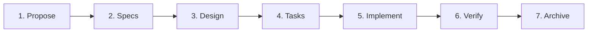
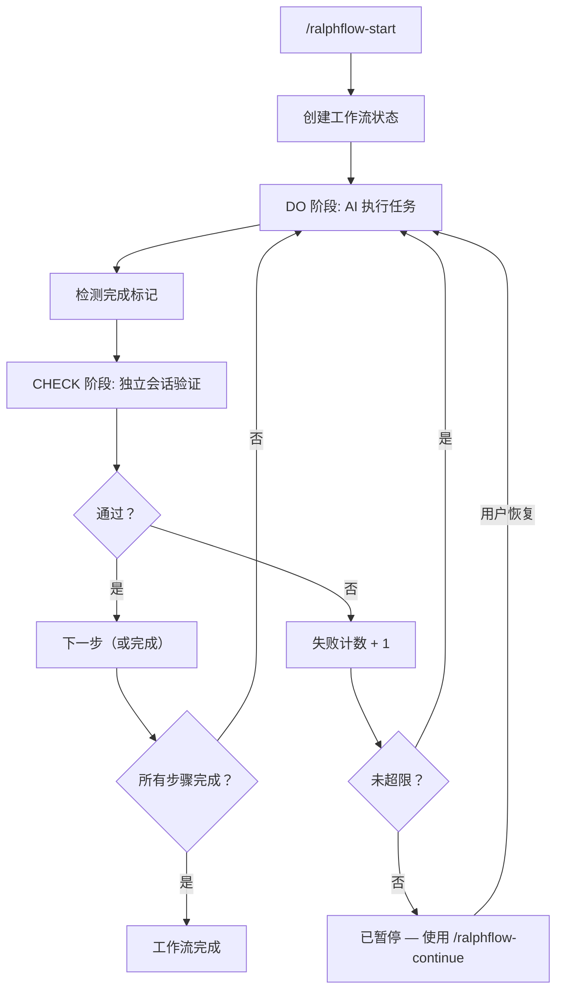

<div align="center">

# ralph-flow

**[opencode](https://opencode.ai) 工作流自动化插件**

让 AI 真正遵循复杂工作流 —— 执行、验证、重试，直到完成。

[](LICENSE)
[](https://opencode.ai)

[English](README.md) · [中文](README_CN.md)

</div>

---

## 问题所在

你告诉 AI："实现用户认证，写测试，更新文档，确保所有测试通过。"

实际发生了什么：
- AI 写了一些代码就停了
- 测试根本没跑
- 文档被遗忘
- 没有任何验证确认代码能工作

**即使你让 AI 自己验证，它也做不到：**
- 自己当运动员又当裁判 —— 对自己的工作降低要求
- 过于自信 —— "看起来没问题" 却没有真正检查
- 归咎于外部因素 —— "测试环境有问题"、"存量代码有 bug"、"依赖版本太旧"

**AI 不会遵循多步骤工作流。** 它会丢失上下文、跳过步骤、永远不真正验证自己的工作。

## 解决方案

ralph-flow 通过**每一步的独立验证**强制 AI 遵循结构化工作流。这不仅仅是提示词工程 —— 它是一个状态机，不会让 AI 跳过步骤或在没有证据的情况下声称"完成"。

---

## ralph-flow vs ralph-loop

| | ralph-loop | ralph-flow |
|---|---|---|
| **类型** | 提示词技巧 | opencode 插件 |
| **工作方式** | 系统提示词中的指令 | 事件驱动的状态机 |
| **验证方式** | 自我审查（有偏差） | 独立会话（无偏差） |
| **多步骤** | 单循环 | 多步骤流水线，支持分支 |
| **状态管理** | 无 | 完整状态追踪，支持暂停/恢复 |
| **失败处理** | 盲目重试 | 携带失败上下文重试 |
| **日志** | 无 | JSON Lines 执行日志 |
| **配置** | 复制提示词到 AGENTS.md | 安装插件，自动注册命令 |

**ralph-flow 是 ralph-loop 的进化版** —— 相同的核心理念（执行 → 验证 → 重试），但作为正式插件构建，具备状态管理、独立验证和多步骤支持。

---

## 内置工作流

### loop — 自动循环执行

> 基于 [opencode-ralph-loop](https://github.com/charfeng1/opencode-ralph-loop) 用工作流重新实现

> **适用场景**：开放式任务、Bug 修复、范围明确的功能开发。

单步骤工作流，持续执行直到满足所有需求。每轮执行 DO → CHECK 循环，检查通过才算完成。

```
/ralphflow-start loop "用 JWT 和 refresh token 实现用户认证模块"
```

```yaml
# workflows/loop.yaml（内置）
steps:
  - id: loop
    desc: 自动循环执行任务
    do: 执行用户指定的任务，逐一实现每个要求
    check: 从完整性、正确性、质量、可验证性四个维度检查
    on_pass: done
    on_fail: loop
    max_fail_count: 100
```

### spec — 规范驱动开发流水线

> 基于 [OpenSpec](https://github.com/Fission-AI/OpenSpec) 用工作流重新实现

> **适用场景**：需要需求 → 设计 → 实现的结构化功能开发。

七步流水线，从提议到归档。每一步产出构件后自动流入下一步，并在每个关口自动验证。

```
/ralphflow-start spec "添加 OAuth2 用户认证功能"
```



---

## 工作原理



CHECK 阶段使用**独立的 AI 会话**，该会话没有实现过程的记忆 —— 它严格按照标准判断，而不是根据 AI "原本打算做什么" 来判断。

---

## ✨ 功能特性

- 🔄 **携带失败上下文的自动重试** — 重试时携带失败原因，让 AI 从错误中学习（最多 100 次）
- 🔍 **独立会话验证** — 独立检查会话避免自我审查偏差；可通过 `adversarial_check.agent` 配置使用哪个 agent
- 📦 **自然语言 YAML** — `do`、`check`、`input`、`output` 都是 plain English 描述，无需学习 DSL
- 🔀 **分支与恢复** — 将失败路由到特定步骤（`on_fail: fix-build`），而不是盲目重试
- 🛠️ **完全可定制** — 复制任意内置工作流并修改；添加自己的步骤、更改验证标准
- 📊 **执行日志** — JSON Lines 格式日志，分步骤追踪和最终报告

---

## 📦 安装方式

在 opencode 配置文件中添加（全局 `~/.config/opencode/opencode.json`，或项目 `opencode.json`）：

```json
{
  "plugin": ["@yibener/ralph-flow"]
}
```

或本地克隆：

```bash
git clone https://github.com/534529531/ralph-flow.git ~/.config/opencode/plugins/ralph-flow
cd ~/.config/opencode/plugins/ralph-flow
npm install && npm run build
```

> 首次加载时插件会自动创建工作流目录和依赖。

---

## 🚀 快速开始

```
/ralphflow-start loop "用 JWT 和 refresh token 实现用户认证模块"
```

| 命令 | 功能 |
|------|------|
| `/ralphflow-status` | 查看当前步骤、阶段、失败次数 |
| `/ralphflow-continue` | 恢复已暂停的工作流 |
| `/ralphflow-cancel` | 取消工作流并生成总结报告 |
| `/ralphflow-list` | 列出所有可用工作流 |

---

## 🛠️ 自定义工作流

在 `.opencode/ralph-flow/workflows/` 目录下创建 `.yaml` 文件：

```yaml
steps:
  - id: analyze
    desc: 需求分析
    do: 分析用户需求并输出设计文档
    input: 用户需求描述
    output: design.md
    check: 验证设计文档是否完整、技术方案是否合理
    on_pass: execute
    on_fail: analyze
    max_fail_count: 3

  - id: execute
    desc: 代码开发
    do: 根据设计文档实现代码
    input: design.md
    output: 可工作的代码
    check: 运行测试并验证实现
    on_pass: done
    on_fail: execute
    max_fail_count: 5
```

**完成标记：** `<promise>done</promise>`、`<promise-check>true/false</promise-check>`

详见[自定义工作流指南](docs/custom-workflows_CN.md)了解分支流转、恢复模式等。

---

## 📚 文档

| 主题 | 说明 |
|------|------|
| [文档首页](docs/README_CN.md) | 从这里开始，按顺序阅读 |
| [自定义工作流](docs/custom-workflows_CN.md) | 创建工作流、配置验证、嵌套工作流 |
| [工作原理](docs/how-it-works_CN.md) | 架构、事件、状态、文件结构 |
| [命令参考](docs/commands_CN.md) | 所有命令和日志事件 |

---

## 📝 开源协议

MIT — 详见 [LICENSE](LICENSE) 文件。

---

<div align="center">

**为 [opencode](https://opencode.ai) 构建** · [报告问题](https://github.com/534529531/ralph-flow/issues)

</div>
