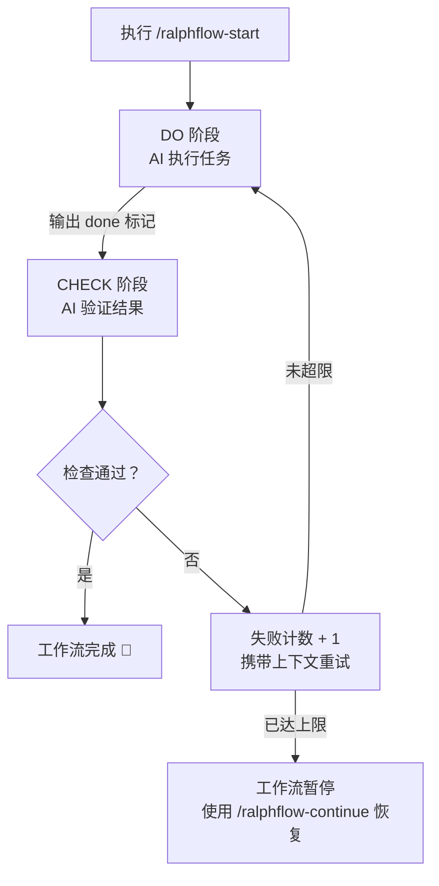
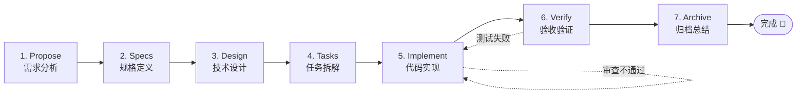
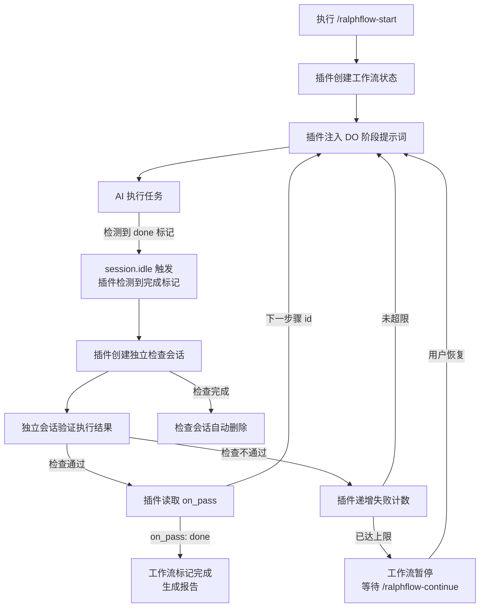
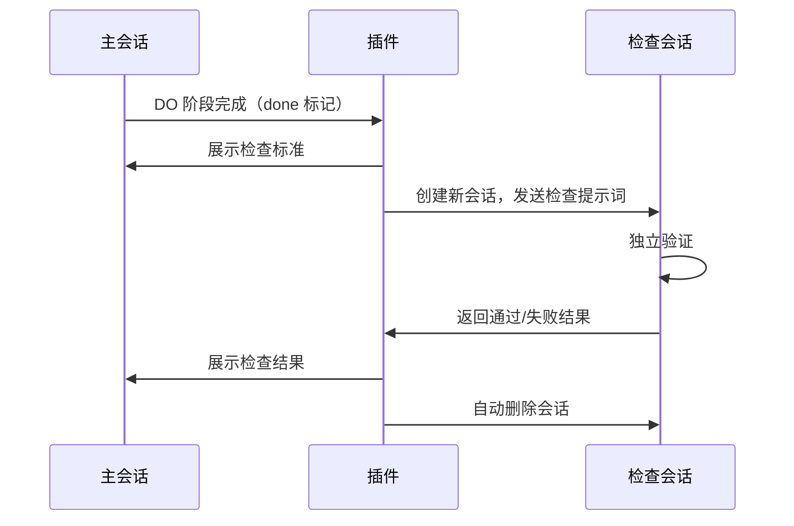

<div align="center">

# ralph-flow

**[opencode](https://opencode.ai) 工作流自动化插件**

将复杂的开发任务转化为自动化的多步骤流水线 —— 每个步骤自带执行、验证和重试机制。

[](LICENSE)
[](https://opencode.ai)

[English](README.md) · [中文](README_CN.md)

</div>

---

## ✨ 功能特性

- **多步骤流水线** — 定义步骤序列，每步含执行（DO）和检查（CHECK）两个阶段
- **独立会话验证** — CHECK 阶段使用独立会话进行审查，避免自我审查偏差，确保严格验证
- **自动重试** — 失败步骤携带上下文自动重试，超限后暂停等待人工干预
- **YAML 驱动** — 零代码创建工作流，仅需一个 `.yaml` 文件
- **内置工作流** — `loop` 自动化循环、`spec` 结构化规范驱动开发
- **日志与报告** — JSON Lines 格式日志、分步骤追踪、最终执行报告
- **即插即用** — 安装一次，工作流自动注册为可用的 slash 命令

---

## 📦 安装方式

### 方式一：npm（推荐）

在 opencode 配置（`opencode.json` 或 `.opencode/config.json`）中添加：

```json
{
  "plugin": ["@yibener/ralph-flow"]
}
```

### 方式二：本地安装

克隆仓库到 opencode 插件目录：

```bash
git clone https://github.com/534529531/ralph-flow.git ~/.config/opencode/plugins/ralph-flow
cd ~/.config/opencode/plugins/ralph-flow
npm install
npm run build
```

在 opencode 配置中直接引用构建产物：

```json
{
  "plugin": ["file:///home/user/.config/opencode/plugins/ralph-flow/dist/index.js"]
}
```

或在插件目录创建桥接文件：

```ts
export { default } from "./ralph-flow/dist/index.js";
```

> 首次加载时插件会自动创建工作流目录和依赖，无需手动配置。

---

## 🚀 快速开始

直接让 AI 启动工作流：

```
/ralphflow-start
```

AI 会引导你选择工作流和描述任务。也可以一步到位：

```
/ralphflow-start loop "用 JWT 和 refresh token 实现用户认证模块"
```

运行过程中，你可以使用以下命令管理工作流：

| 命令                    | 功能                  |
| --------------------- | ------------------- |
| `/ralphflow-status`   | 查看当前步骤、阶段、失败次数     |
| `/ralphflow-continue` | 恢复已暂停的工作流           |
| `/ralphflow-cancel`   | 取消工作流并生成总结报告        |
| `/ralphflow-list`     | 列出所有可用工作流           |

---

## 📋 内置工作流

### loop — 自动循环执行

> **适用场景**：开放式任务、Bug 修复、范围明确的功能开发。

单步骤工作流，持续执行直到满足所有需求。每轮执行 DO → CHECK 循环，检查通过才算完成。

```yaml
# workflows/loop.yaml（内置）
steps:
  - id: loop
    desc: 自动循环执行任务
    do: 执行用户指定的任务，持续工作直到完全完成
    check: 严格审查模式，使用独立审查和工具验证
    on_pass: done
    on_fail: loop
    max_fail_count: 100
```

<details>
<summary>工作原理</summary>



</details>

---

### spec — 规范驱动开发流水线

> **适用场景**：需要需求 → 设计 → 实现的结构化功能开发。

受 [OpenSpec OPSX 工作流](https://github.com/Fission-AI/OpenSpec) 启发，该流水线涵盖七个步骤 —— 从提议到归档。每一步产出构件后自动流入下一步，并在每个关口自动验证。



**各步骤产出的构件：**

| 步骤      | 产出文件                                    | 用途                    |
| ------- | --------------------------------------- | --------------------- |
| Propose | `proposal.md`                           | 为什么做、做什么、验收标准          |
| Specs   | `specs.md`                              | Delta 规格（ADDED / MODIFIED / REMOVED） |
| Design  | `design.md`                             | 架构设计、数据流、文件变更清单       |
| Tasks   | `tasks.md`                              | 可勾选的实现任务列表             |
| Implement | —（代码修改）                               | 逐个任务实现                 |
| Verify  | `verification.md`                       | 验收报告                   |
| Archive | `summary.md`                            | 变更总结                   |

所有构件统一存储在 `.opencode/ralph-flow/artifacts/` 目录下。

---

## 🛠️ 自定义工作流

在 `.opencode/ralph-flow/workflows/` 目录下创建 `.yaml` 文件即可定义自己的工作流。

### 结构示例

```yaml
manual_phase:                     # 可选：逗号分隔的 "步骤ID.阶段"，需要用户手动继续

steps:
  - id: analyze
    desc: 需求分析
    do: 分析用户需求并输出设计文档
    input: 用户需求描述
    output: design.md
    check: 验证设计文档是否完整、技术方案是否合理
    on_pass: execute              # 检查通过后执行的下一步
    on_fail: analyze              # 检查失败后进入的步骤
    max_fail_count: 3

  - id: execute
    desc: 代码开发
    do: 根据设计文档实现代码
    input: design.md
    output: 可工作的代码
    check: 运行测试并验证实现
    on_pass: done
    on_fail: execute
    max_fail_count: 5
```

### 步骤字段说明

| 字段               | 必填  | 说明                        |
| ---------------- | --- | ------------------------- |
| `id`             | ✅   | 步骤唯一标识                    |
| `desc`           | ✅   | 步骤描述                      |
| `do`             | ✅   | 任务执行提示词                   |
| `input`          | ✅   | 预期输入说明                    |
| `output`         | ✅   | 预期输出说明                    |
| `check`          | ✅   | 验证标准                      |
| `on_pass`        | ✅   | 通过后的下一步（步骤 id 或 `"done"` 表示完成） |
| `on_fail`        | ✅   | 失败后的下一步（步骤 id）            |
| `max_fail_count` | ✅   | 最大失败次数（每个步骤独立）            |

### 完成标记

AI 通过 XML 风格的标记来标识完成状态：

| 阶段      | 标记                                       | 说明      |
| ------- | ---------------------------------------- | ------- |
| DO 执行阶段 | `<promise>done</promise>`                | 任务完成    |
| CHECK 检查阶段 | `<promise-check>true</promise-check>`    | 验证通过    |
| CHECK 检查阶段 | `<promise-check>false</promise-check>`   | 验证未通过   |

> 标记**不区分大小写**，允许空格。`<promise>DONE</promise>` 同样有效。

### 手动阶段

在 `manual_phase` 中指定需要人工确认的阶段：

```yaml
manual_phase: analyze.do, execute.check
```

列入该列表的阶段，AI 完成工作后**不会自动继续**——需要你手动执行 `/ralphflow-continue`。

---

## ⚙️ 工作原理

### 核心循环



### 独立会话验证

CHECK 阶段使用**独立会话**来验证任务完成情况，避免自我审查偏差：



**为什么使用独立会话？**
- **无自我审查偏差** — 检查者没有实现过程的记忆
- **严格验证** — 仅根据检查标准判断，不受 AI "意图" 影响
- **干净的上下文** — 没有可能影响判断的累积上下文

**检查会话权限：**

CHECK 阶段默认使用 `ralph-check` agent，权限配置如下：

| 权限 | 配置 | 说明 |
|------|------|------|
| `edit` | `deny` | 禁止修改文件，确保检查者不会"顺手"修改代码 |
| `bash` | `allow` | 允许执行验证命令（测试、检查文件等） |

插件启动时会自动注册 `ralph-check` agent，无需手动配置。如需自定义，可在工作流 YAML 中覆盖：

```yaml
adversarial_check:
  agent: "build"  # 使用其他 agent
```

**用户体验：**
- 检查开始前，主会话展示检查标准
- 检查完成后，结果（通过/失败及原因）注入主会话
- 失败时，失败上下文会包含在重试的 DO 阶段中

### 多步骤流转

检查通过时，插件读取 `on_pass` 跳转到下一步的 DO 阶段；检查失败时读取 `on_fail` —— 可以重试当前步骤（携带失败上下文），也可以跳转到专门的修复步骤。

### 事件驱动

插件通过 `session.idle` 事件监听 AI 响应，自动检测完成标记并推动工作流前进。`session.deleted` 事件会自动将工作流标记为暂停，方便后续恢复。

---

## 📁 文件结构

所有生成文件统一放在 `.opencode/ralph-flow/` 目录下：

```
.opencode/
└── ralph-flow/                    # 插件根目录
    ├── ralph-flow.local.md        # 工作流状态（markdown frontmatter）
    ├── workflows/                 # 自定义工作流 YAML 定义
    │   ├── loop.yaml              # 内置：自动循环
    │   └── spec.yaml              # 内置：规范驱动流水线
    ├── artifacts/                 # spec 工作流生成的构件
    │   ├── proposal.md
    │   ├── specs.md
    │   ├── design.md
    │   ├── tasks.md
    │   ├── verification.md
    │   └── summary.md
    ├── logs/                      # 执行日志（JSON Lines）
    │   ├── execution.log
    │   ├── step-*.log
    │   └── final-report.md
    └── package.json               # 自动管理的依赖文件
```

---

## 📟 命令参考

| Slash 命令              | 工具                      | 功能         |
| --------------------- | ----------------------- | ---------- |
| `/ralphflow-start`    | `ralphflow-start`       | 启动工作流      |
| `/ralphflow-continue` | `ralphflow-continue`    | 恢复暂停的工作流   |
| `/ralphflow-cancel`   | `ralphflow-cancel`      | 取消并生成报告    |
| `/ralphflow-status`   | `ralphflow-status`      | 查看当前工作流状态  |
| `/ralphflow-list`     | `ralphflow-list`        | 列出可用工作流    |

### 日志事件

事件以 JSON Lines 格式记录到 `.opencode/ralph-flow/logs/execution.log`：

| 事件                     | 说明              |
| ---------------------- | --------------- |
| `workflow_start`       | 工作流开始           |
| `workflow_end`         | 工作流结束           |
| `step_start`           | 步骤阶段开始          |
| `done_detected`        | 检测到完成标记         |
| `check_result`         | 检查结果            |
| `fail_count_increment` | 失败计数增加          |
| `workflow_paused`      | 工作流暂停（达到最大失败次数） |
| `workflow_resumed`     | 工作流被用户恢复        |
| `workflow_cancelled`   | 工作流被用户取消        |

---

## 📝 开源协议

MIT — 详见 [LICENSE](LICENSE) 文件。

---

<div align="center">

**为 [opencode](https://opencode.ai) 构建** · [报告问题](https://github.com/534529531/ralph-flow/issues)

</div>
