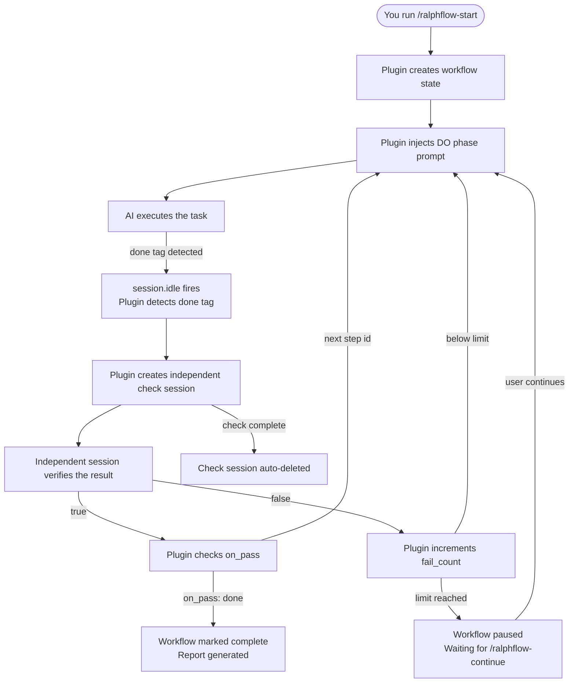

# How It Works

This document explains the internal mechanics of ralph-flow.

---

## Core Cycle

Every workflow follows the same fundamental cycle:



### Phase Details

**DO Phase:**
1. Plugin injects the step's `do` prompt into the session
2. AI executes the task
3. When done, AI outputs `<promise>done</promise>`
4. Plugin detects the tag via `session.idle` event

**CHECK Phase:**
1. Plugin displays the `check` criteria in the main session
2. Plugin creates an independent check session
3. Check session evaluates the work against criteria
4. Check session returns `<promise-check>true</promise-check>` or `<promise-check>false</promise-check>`
5. Plugin processes the result and either advances or retries
6. Check session is automatically deleted

---

## Independent Session Verification

The CHECK phase uses an **independent session** to verify task completion, preventing self-review bias.

```mermaid
sequenceDiagram
    participant Main as Main Session
    participant Plugin as Plugin
    participant Check as Check Session

    Main->>Plugin: DO phase complete (done tag)
    Plugin->>Main: Shows check criteria
    Plugin->>Check: Create new session with check prompt
    Check->>Check: Independent verification
    Check->>Plugin: Returns pass/fail result
    Plugin->>Main: Shows check result
    Plugin->>Check: Auto-delete session
```



### Why Independent Sessions?

- **No self-review bias** — the checker has no memory of the implementation process
- **Strict verification** — checks against criteria only, not against what the AI "intended" to do
- **Clean context** — no accumulated context that could influence the judgment

### Check Session Permissions

The CHECK phase uses the `ralph-check` agent by default:

| Permission | Config | Description |
|------------|--------|-------------|
| `edit` | `deny` | Prevents the checker from modifying code |
| `bash` | `allow` | Allows running verification commands (tests, file checks, etc.) |

The plugin automatically registers the `ralph-check` agent on startup — no manual configuration needed.

To override, specify in your workflow YAML:

```yaml
adversarial_check:
  agent: "build"              # Use a different agent
  model:                      # Use a specific model
    providerID: "anthropic"
    modelID: "claude-haiku-4-5"
  system_prompt: |            # Custom verification criteria
    You are a strict code reviewer.
```

See [Custom Workflows → adversarial_check](custom-workflows.md#adversarial_check) for full configuration reference.

---

## Multi-Step Flow

When a check passes, the plugin reads `on_pass` and transitions to the next step's DO phase. When it fails, the plugin reads `on_fail` — either retrying the same step (with failure context) or jumping to a recovery step.

### Failure Context

When a step fails, the plugin captures:
- The check result (why it failed)
- The current fail count
- Any output from the DO phase

This context is injected into the next DO phase attempt, helping the AI learn from mistakes.

---

## Session Events

The plugin hooks into opencode's session events to drive the workflow:

| Event | Trigger | Action |
|-------|---------|--------|
| `session.idle` | AI finishes responding | Detect completion tags, advance workflow |
| `session.deleted` | Session is removed | Mark workflow as paused |

### Tag Detection

The plugin scans AI responses for completion tags:

- `<promise>done</promise>` — signals DO phase completion
- `<promise-check>true</promise-check>` — signals CHECK passed
- `<promise-check>false</promise-check>` — signals CHECK failed

Tags are case-insensitive and tolerate whitespace variations.

---

## State Management

Workflow state is stored in `.opencode/ralph-flow/ralph-flow.local.md` as markdown frontmatter:

```markdown
---
workflow: loop
current_step: loop
phase: do
fail_count: 0
status: running
started_at: 2024-01-15T10:30:00Z
---
```

This file is automatically managed by the plugin — you should not edit it manually.

---

## Logging

All events are logged to `.opencode/ralph-flow/logs/execution.log` in JSON Lines format:

```jsonl
{"event":"workflow_start","workflow":"loop","timestamp":"2024-01-15T10:30:00Z"}
{"event":"step_start","step":"loop","phase":"do","timestamp":"2024-01-15T10:30:01Z"}
{"event":"done_detected","step":"loop","timestamp":"2024-01-15T10:35:22Z"}
{"event":"check_result","step":"loop","result":true,"timestamp":"2024-01-15T10:36:45Z"}
{"event":"workflow_end","workflow":"loop","timestamp":"2024-01-15T10:36:46Z"}
```

See [Commands Reference](commands.md) for the complete list of log events.

---

## File Structure

All generated files are scoped under `.opencode/ralph-flow/`:

```
.opencode/
└── ralph-flow/                    # Plugin root
    ├── ralph-flow.local.md        # Workflow state (markdown frontmatter)
    ├── workflows/                 # Custom workflow YAML definitions
    │   ├── loop.yaml              # Built-in: auto-loop
    │   └── spec.yaml              # Built-in: spec-driven pipeline
    ├── artifacts/                 # Generated by spec workflow
    │   ├── proposal.md
    │   ├── specs.md
    │   ├── design.md
    │   ├── tasks.md
    │   ├── verification.md
    │   └── summary.md
    ├── logs/                      # Execution logs (JSON Lines)
    │   ├── execution.log
    │   ├── step-*.log
    │   └── final-report.md
    └── package.json               # Auto-managed dependencies
```

### Key Files

| File | Description |
|------|-------------|
| `ralph-flow.local.md` | Workflow state (current step, phase, fail counts). **Do not edit manually.** |
| `workflows/` | Your custom workflow YAML files. Ships with `loop.yaml` and `spec.yaml`. |
| `artifacts/` | Generated artifacts from spec workflow. |
| `logs/` | Execution logs in JSON Lines format. |
| `package.json` | Auto-managed dependencies. |
