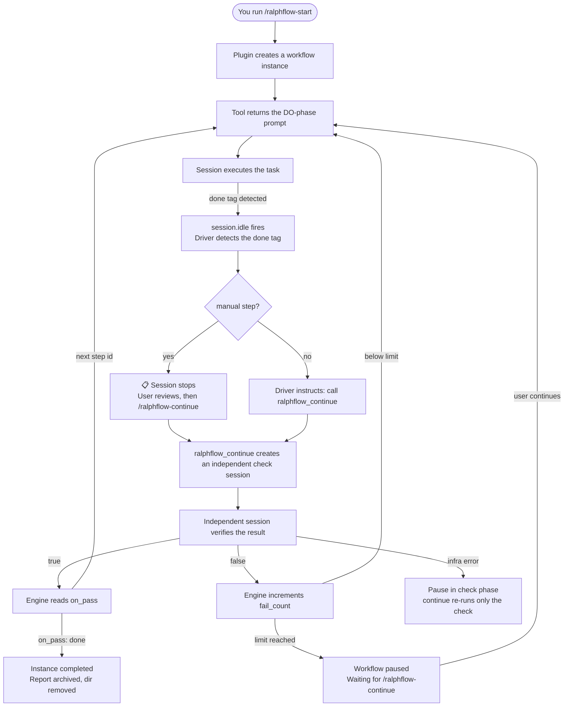
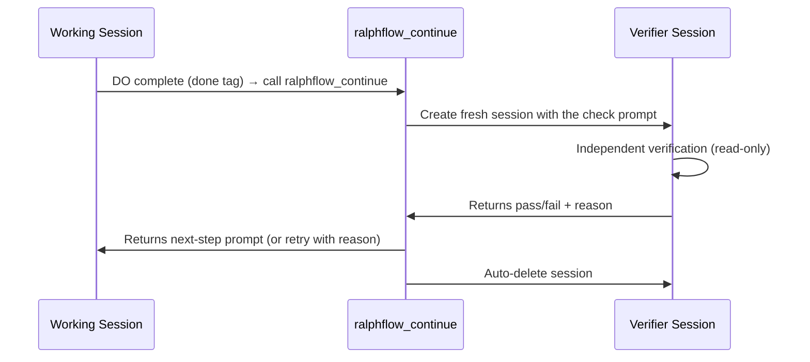
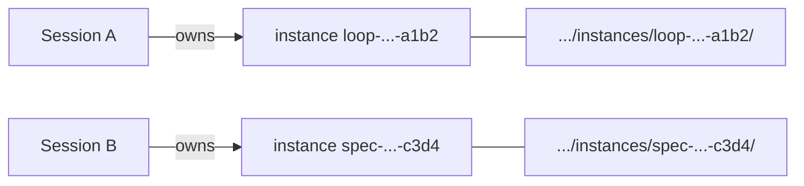

# How It Works

[English](how-it-works.md) · [中文](how-it-works_CN.md)

This document explains the internal mechanics of ralph-flow.

---

## Core Cycle

Every workflow follows the same fundamental cycle:


```mermaid
flowchart TD
    Start(["You run /ralphflow-start"]) --> State["Plugin creates a workflow instance"]
    State --> DoPrompt["Tool returns the DO-phase prompt"]
    DoPrompt --> AI["Session executes the task"]
    AI -->|"done tag detected"| DoneTag["session.idle fires<br/>Driver detects the done tag"]
    DoneTag --> Manual{"manual step?"}
    Manual -->|"yes"| Review["📋 Session stops<br/>User reviews, then /ralphflow-continue"]
    Manual -->|"no"| CallContinue["Driver instructs: call ralphflow_continue"]
    Review --> CheckPrompt
    CallContinue --> CheckPrompt["ralphflow_continue creates an independent check session"]
    CheckPrompt --> AICheck["Independent session verifies the result"]
    AICheck -->|"true"| Pass["Engine reads on_pass"]
    AICheck -->|"false"| Fail["Engine increments fail_count"]
    AICheck -->|"infra error"| Infra["Pause in check phase<br/>continue re-runs only the check"]
    Pass -->|"on_pass: done"| Complete["Instance completed<br/>Report archived, dir removed"]
    Pass -->|"next step id"| DoPrompt
    Fail -->|"below limit"| DoPrompt
    Fail -->|"limit reached"| Pause["Workflow paused<br/>Waiting for /ralphflow-continue"]
    Pause -->|user continues| DoPrompt
```

### Phase Details

**DO Phase** (the working session):
1. The `ralphflow_start` / `ralphflow_continue` tool returns the step's DO prompt
2. The session executes the task (writes code, runs commands, produces the named output)
3. When done, it outputs `<promise>done</promise>` on the last line
4. The driver detects the tag via the `session.idle` event

**CHECK Phase** (an independent session):
1. `ralphflow_continue` builds the step's check prompt and spins up a fresh verifier session (the read-only `ralph-check` agent)
2. The verifier explores the project and evaluates the work against the check criteria — it never saw the DO conversation
3. It returns `<promise-check>true</promise-check>` or `<promise-check>false</promise-check>` on its last line
4. The engine processes the result and either advances (`on_pass`) or retries with the failure reason (`on_fail`)
5. The verifier session is deleted

---

## Independent Session Verification

The CHECK phase uses an **independent session** to verify task completion, preventing self-review bias.


```mermaid
sequenceDiagram
    participant Main as Working Session
    participant Tool as ralphflow_continue
    participant Check as Verifier Session

    Main->>Tool: DO complete (done tag) → call ralphflow_continue
    Tool->>Check: Create fresh session with the check prompt
    Check->>Check: Independent verification (read-only)
    Check->>Tool: Returns pass/fail + reason
    Tool->>Main: Returns next-step prompt (or retry with reason)
    Tool->>Check: Auto-delete session
```

### Why independent sessions?

- **No self-review bias** — the checker has no memory of the implementation process
- **Strict verification** — checks against criteria only, not against what the AI "intended"
- **Clean context** — no accumulated context that could soften the judgment

### Verifier permissions

The CHECK phase uses the `ralph-check` agent by default:

| Permission | Config | Description |
|------------|--------|-------------|
| `edit` | `deny` | The checker cannot modify code — it only reads and verifies |
| `bash` | `allow` | Can run verification commands (tests, builds, file checks) |
| `external_directory` | `allow` | Can read `extra_dirs` declared at start (source material outside the project) |

The plugin registers the `ralph-check` agent two ways — in-memory via its `config` hook, and as a file in the global `~/.config/opencode/agent/` (never your project) — so no manual configuration is needed.

To override, specify in your workflow YAML:

```yaml
adversarial_check:
  agent: build                 # use a different agent
  model:                       # use a specific model
    providerID: anthropic
    modelID: claude-haiku-4-5
  system_prompt: |             # extra system prompt for the checker
    You are a strict code reviewer.
  timeout_ms: 3600000          # capped at 1 hour
```

The `model` field also accepts a `"provider/model"` string. A bare model name (e.g. `sonnet`) cannot be resolved and falls back to the agent's default model — `/ralphflow-doctor` warns about this.

### Infrastructure vs work failures

If the verifier session itself can't run (API error, timeout, session-create failure), that says **nothing** about the quality of the work. The engine does **not** count it as a step failure and does **not** send the working session back to redo finished work. Instead it pauses in the check phase; the next `/ralphflow-continue` re-runs **only** the verification.

---

## Manual Review Gates

Steps listed in a workflow's `manual_step` pause **after DO completes but before verification**. When the done tag is detected on such a step, the driver does *not* drive the model forward — it stops the session with a 📋 message and waits. The user's `/ralphflow-continue` is the approval that starts the independent verification. If the user asks for changes, the session makes them and emits `<promise>done</promise>` again — the gate re-arms.

---

## Multi-Step Flow & Sub-Workflows

When a check passes, the engine reads `on_pass` and transitions to the next step's DO phase. When it fails, it reads `on_fail` — either retrying the same step (with failure context) or jumping to a recovery step.

A step can delegate to another workflow via `workflow:` instead of `do`/`check`. The parent state is pushed onto a per-instance stack; when the sub-workflow completes, the engine pops back and advances the parent. Nesting is capped at depth 5, and cycles are detected by `/ralphflow-doctor`.

### Failure context

When a step fails, the retry DO prompt carries:
- The verifier's exact failure reason
- The current retry count and `max_fail_count`

This helps the working session fix the actual problem instead of repeating the failed approach.

---

## Multi-Instance Model

One plugin process serves every session of a project. Each `ralphflow_start` creates an isolated **instance**:


```mermaid
flowchart LR
    S1["Session A"] -->|owns| I1["instance loop-...-a1b2"]
    S2["Session B"] -->|owns| I2["instance spec-...-c3d4"]
    I1 --- D1[".../instances/loop-...-a1b2/"]
    I2 --- D2[".../instances/spec-...-c3d4/"]
```

- One session drives at most one instance; parallel sessions each drive their own.
- The driver only ever acts on the instance whose `owner-session` matches the idling session — parallel sessions and the verifier session never interfere.
- When the owning session is gone (opencode restarted), any session's `/ralphflow-continue` can take an instance over. See [Commands → Instance model](commands.md#instance-model).

---

## Session Events

The plugin hooks opencode's session events to drive workflows:

| Event | Trigger | Action |
|-------|---------|--------|
| `session.idle` | Session finishes responding | Detect the done tag, drive the workflow / keep-alive |
| `session.compacted` | Context was compacted | Re-drive with the cached DO prompt |
| `session.error` (aborted) | User interrupted the run | Pause the instance |
| `session.deleted` | Session removed | Pause the instance (becomes an orphan) |
| `chat.message` | Any user message | Record session liveness (for takeover detection) |

### Tag detection

- `<promise>done</promise>` — DO phase complete (detected on the last line or within the last 100 chars; ignored inside code fences/inline code)
- `<promise-check>true|false</promise-check>` — CHECK verdict (must occupy the verifier's last line)

Tags are case-insensitive and tolerate whitespace.

---

## State Management

Each instance's state lives in `.opencode/ralph-flow/instances/<id>/state.json`:

```json
{
  "active": true,
  "workflow_name": "loop",
  "current_step": "loop",
  "current_phase": "do",
  "fail_count": 0,
  "user_task": "...",
  "paused": false,
  "instance_id": "loop-260710120000-ab12"
}
```

Writes are atomic (temp file + rename), and a corrupt/invalid file is backed up rather than trusted. The plugin manages these files — do not edit them manually.

Interrupted **pre-2.0** workflows (`ralph-flow.local.md`) are migrated into this layout on first startup.

---

## Logging

Per-instance events are logged to `.opencode/ralph-flow/instances/<id>/logs/execution.log` in JSON Lines format (rotated at 10 MB):

```jsonl
{"ts":"...","level":"info","event":"workflow_start","workflow":"loop","instance":"loop-...-ab12"}
{"ts":"...","level":"info","event":"step_start","step":"loop","phase":"do"}
{"ts":"...","level":"info","event":"done_detected","step":"loop"}
{"ts":"...","level":"info","event":"adversarial_check_result","stepId":"loop","passed":true}
{"ts":"...","level":"info","event":"workflow_end","workflow":"loop"}
```

See [Commands Reference](commands.md#log-events) for the full list of events.

---

## File Structure

Per-project state lives under `.opencode/ralph-flow/`; user-global config lives under `~/.config/opencode/`.

```
<project>/.opencode/
└── ralph-flow/
    ├── instances/
    │   └── <id>/                   # One directory per workflow instance
    │       ├── state.json          # Workflow state (do NOT edit)
    │       ├── state-stack.json    # Sub-workflow nesting stack
    │       ├── owner-session        # Driving session id
    │       ├── artifacts-dir        # Name of this instance's artifacts dir
    │       ├── .do-prompt-cache     # Current DO prompt (keep-alive re-injects)
    │       ├── .manual-gate         # Manual review markers
    │       └── logs/
    │           ├── execution.log
    │           └── step-records.json
    ├── artifacts/
    │   └── <task>-<suffix>/        # Deliverables — survive completion
    ├── reports/
    │   └── <id>-final-report.md    # Archived on completion/cancel
    └── workflows/                  # Project-only custom workflows (highest priority)

~/.config/opencode/                 # user-global — NOT in your project tree
├── agent/
│   └── ralph-check.md              # Read-only verifier agent (auto-written, managed)
├── skills/                         # Bundled skills synced here (auto, managed marker)
└── ralph-flow/
    └── workflows/                  # Global custom workflows (all projects)
```

**Workflow resolution** is `project → global → plugin built-in`. The built-ins (`loop`, `spec`, `c-to-rust`, `everything2rust`) resolve from the plugin's own `workflows/` directory, so they always reflect the installed version — they are never copied into your project or global dir (which would let them go stale). A same-named workflow in the project or global dir shadows the tiers below it.

**Skills** aren't loaded by our engine — opencode's native `skill` tool discovers them from fixed filesystem locations. The bundled c-to-rust / everything2rust skills are synced into the global `~/.config/opencode/skills/` (each carrying a `.ralph-flow-managed` marker so your own same-named skills are never touched), keeping your project tree clean.
