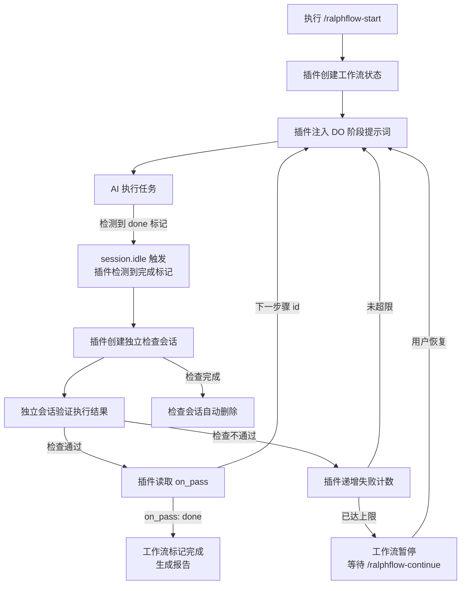
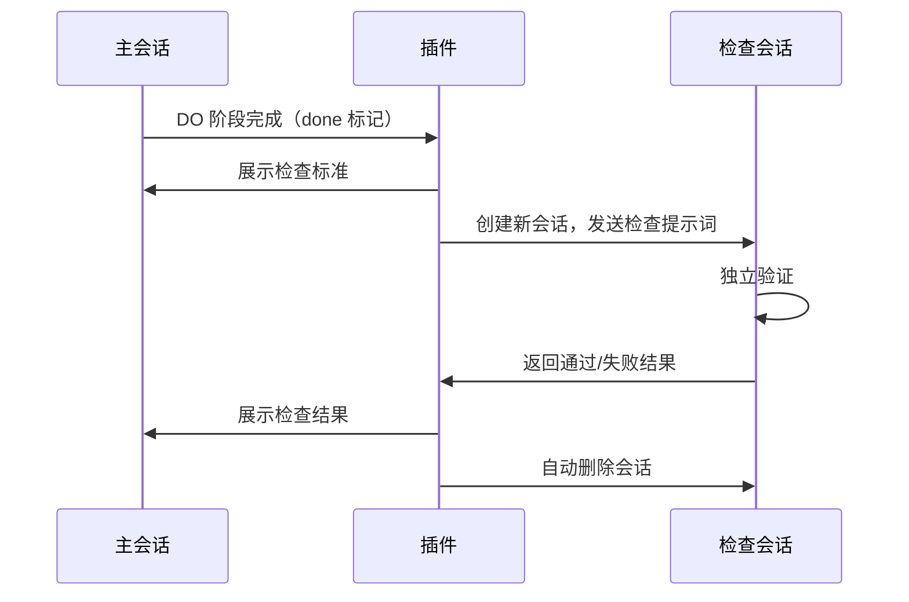

# 工作原理

本文档解释 ralph-flow 的内部工作机制。

---

## 核心循环

每个工作流都遵循相同的基本循环：



### 阶段详解

**DO 阶段：**
1. 插件将步骤的 `do` 提示词注入会话
2. AI 执行任务
3. 完成后，AI 输出 `<promise>done</promise>`
4. 插件通过 `session.idle` 事件检测到标记

**CHECK 阶段：**
1. 插件在主会话中展示 `check` 检查标准
2. 插件创建独立的检查会话
3. 检查会话根据标准评估工作成果
4. 检查会话返回 `<promise-check>true</promise-check>` 或 `<promise-check>false</promise-check>`
5. 插件处理结果，前进或重试
6. 检查会话自动删除

---

## 独立会话验证

CHECK 阶段使用**独立会话**来验证任务完成情况，避免自我审查偏差。



### 为什么使用独立会话？

- **无自我审查偏差** — 检查者没有实现过程的记忆
- **严格验证** — 仅根据检查标准判断，不受 AI "意图" 影响
- **干净的上下文** — 没有可能影响判断的累积上下文

### 检查会话权限

CHECK 阶段默认使用 `ralph-check` agent：

| 权限 | 配置 | 说明 |
|------|------|------|
| `edit` | `deny` | 禁止修改文件 |
| `bash` | `allow` | 允许执行验证命令（测试、检查文件等） |

插件启动时会自动注册 `ralph-check` agent，无需手动配置。

如需自定义，可在工作流 YAML 中覆盖：

```yaml
adversarial_check:
  agent: "build"              # 使用其他 agent
  model:                      # 指定验证使用的模型
    providerID: "anthropic"
    modelID: "claude-haiku-4-5"
  system_prompt: |            # 自定义验证标准
    你是一个严格的代码审查员。
```

完整配置参考请见[自定义工作流 → adversarial_check](custom-workflows_CN.md#adversarial_check)。

---

## 多步骤流转

检查通过时，插件读取 `on_pass` 跳转到下一步的 DO 阶段；检查失败时读取 `on_fail` —— 可以重试当前步骤（携带失败上下文），也可以跳转到专门的修复步骤。

### 失败上下文

当步骤失败时，插件会捕获：
- 检查结果（失败原因）
- 当前失败次数
- DO 阶段的任何输出

这些上下文会注入到下一次 DO 阶段的尝试中，帮助 AI 从错误中学习。

---

## 会话事件

插件通过 opencode 的会话事件驱动工作流：

| 事件 | 触发时机 | 动作 |
|------|----------|------|
| `session.idle` | AI 完成响应 | 检测完成标记，推进工作流 |
| `session.deleted` | 会话被删除 | 将工作流标记为暂停 |

### 标记检测

插件扫描 AI 响应中的完成标记：

- `<promise>done</promise>` — DO 阶段完成
- `<promise-check>true</promise-check>` — CHECK 通过
- `<promise-check>false</promise-check>` — CHECK 失败

标记不区分大小写，允许空格变化。

---

## 状态管理

工作流状态存储在 `.opencode/ralph-flow/ralph-flow.local.md` 的 markdown frontmatter 中：

```markdown
---
workflow: loop
current_step: loop
phase: do
fail_count: 0
status: running
started_at: 2024-01-15T10:30:00Z
---
```

此文件由插件自动管理，不应手动编辑。

---

## 日志记录

所有事件以 JSON Lines 格式记录到 `.opencode/ralph-flow/logs/execution.log`：

```jsonl
{"event":"workflow_start","workflow":"loop","timestamp":"2024-01-15T10:30:00Z"}
{"event":"step_start","step":"loop","phase":"do","timestamp":"2024-01-15T10:30:01Z"}
{"event":"done_detected","step":"loop","timestamp":"2024-01-15T10:35:22Z"}
{"event":"check_result","step":"loop","result":true,"timestamp":"2024-01-15T10:36:45Z"}
{"event":"workflow_end","workflow":"loop","timestamp":"2024-01-15T10:36:46Z"}
```

完整的日志事件列表请参阅[命令参考](commands_CN.md)。

---

## 文件结构

所有生成文件统一放在 `.opencode/ralph-flow/` 目录下：

```
.opencode/
└── ralph-flow/                    # 插件根目录
    ├── ralph-flow.local.md        # 工作流状态（markdown frontmatter）
    ├── workflows/                 # 自定义工作流 YAML 定义
    │   ├── loop.yaml              # 内置：自动循环
    │   └── spec.yaml              # 内置：规范驱动流水线
    ├── artifacts/                 # spec 工作流生成的构件
    │   ├── proposal.md
    │   ├── specs.md
    │   ├── design.md
    │   ├── tasks.md
    │   ├── verification.md
    │   └── summary.md
    ├── logs/                      # 执行日志（JSON Lines）
    │   ├── execution.log
    │   ├── step-*.log
    │   └── final-report.md
    └── package.json               # 自动管理的依赖文件
```

### 关键文件

| 文件 | 说明 |
|------|------|
| `ralph-flow.local.md` | 工作流状态（当前步骤、阶段、失败次数）。**不要手动编辑。** |
| `workflows/` | 你的自定义工作流 YAML 文件。内置 `loop.yaml` 和 `spec.yaml`。 |
| `artifacts/` | spec 工作流生成的构件。 |
| `logs/` | JSON Lines 格式的执行日志。 |
| `package.json` | 自动管理的依赖。 |
