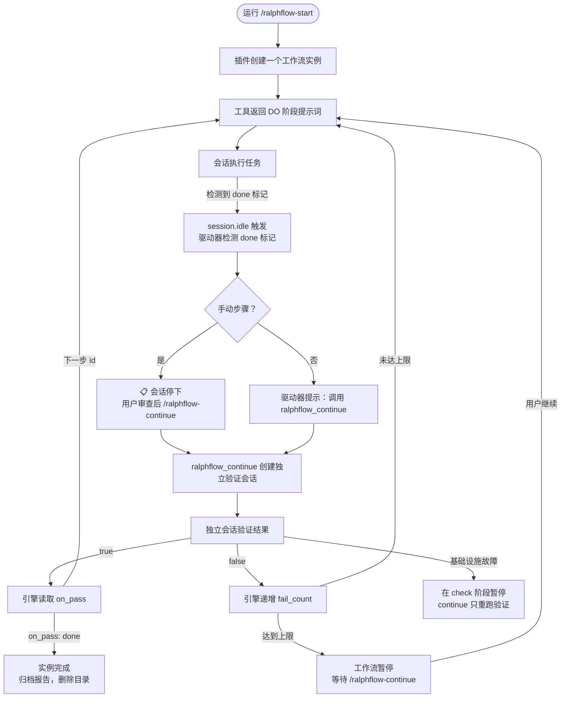
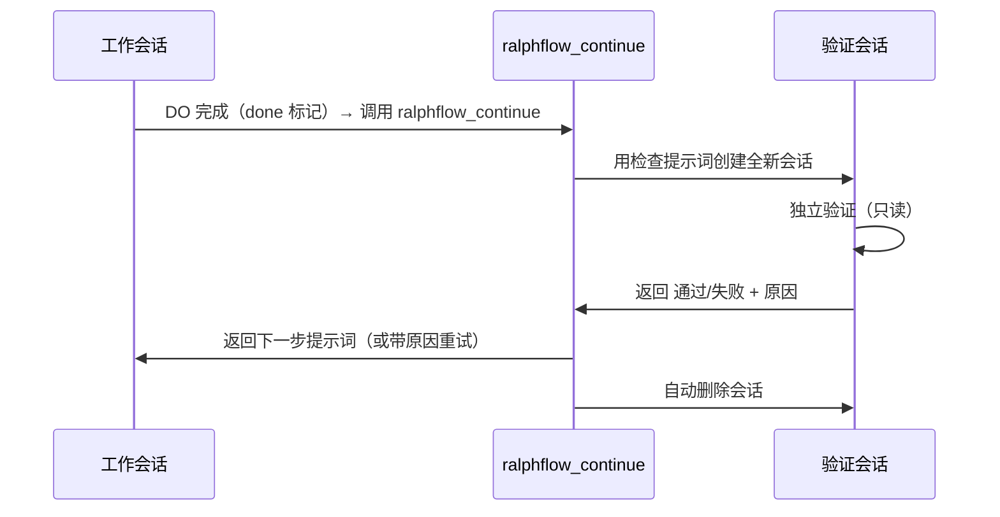
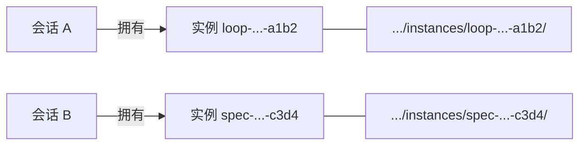

# 工作原理

[English](how-it-works.md) · [中文](how-it-works_CN.md)

本文档解释 ralph-flow 的内部工作机制。

---

## 核心循环

每个工作流都遵循同一个基本循环：


```mermaid
flowchart TD
    Start(["运行 /ralphflow-start"]) --> State["插件创建一个工作流实例"]
    State --> DoPrompt["工具返回 DO 阶段提示词"]
    DoPrompt --> AI["会话执行任务"]
    AI -->|"检测到 done 标记"| DoneTag["session.idle 触发<br/>驱动器检测 done 标记"]
    DoneTag --> Manual{"手动步骤？"}
    Manual -->|"是"| Review["📋 会话停下<br/>用户审查后 /ralphflow-continue"]
    Manual -->|"否"| CallContinue["驱动器提示：调用 ralphflow_continue"]
    Review --> CheckPrompt
    CallContinue --> CheckPrompt["ralphflow_continue 创建独立验证会话"]
    CheckPrompt --> AICheck["独立会话验证结果"]
    AICheck -->|"true"| Pass["引擎读取 on_pass"]
    AICheck -->|"false"| Fail["引擎递增 fail_count"]
    AICheck -->|"基础设施故障"| Infra["在 check 阶段暂停<br/>continue 只重跑验证"]
    Pass -->|"on_pass: done"| Complete["实例完成<br/>归档报告，删除目录"]
    Pass -->|"下一步 id"| DoPrompt
    Fail -->|"未达上限"| DoPrompt
    Fail -->|"达到上限"| Pause["工作流暂停<br/>等待 /ralphflow-continue"]
    Pause -->|用户继续| DoPrompt
```

### 阶段细节

**DO 阶段**（工作会话）：
1. `ralphflow_start` / `ralphflow_continue` 工具返回步骤的 DO 提示词
2. 会话执行任务（写代码、跑命令、产出指定输出）
3. 完成后在最后一行输出 `<promise>done</promise>`
4. 驱动器通过 `session.idle` 事件检测标记

**CHECK 阶段**（独立会话）：
1. `ralphflow_continue` 构建步骤的检查提示词，拉起一个全新的验证会话（只读 `ralph-check` agent）
2. 验证者自主探索项目，按检查依据评估工作成果 —— 它完全没看过 DO 阶段的对话
3. 在最后一行返回 `<promise-check>true</promise-check>` 或 `<promise-check>false</promise-check>`
4. 引擎处理结果，要么推进（`on_pass`），要么带失败原因重试（`on_fail`）
5. 验证会话被删除

---

## 独立会话验证

CHECK 阶段用**独立会话**验证任务完成情况，杜绝自我审查偏差。


```mermaid
sequenceDiagram
    participant Main as 工作会话
    participant Tool as ralphflow_continue
    participant Check as 验证会话

    Main->>Tool: DO 完成（done 标记）→ 调用 ralphflow_continue
    Tool->>Check: 用检查提示词创建全新会话
    Check->>Check: 独立验证（只读）
    Check->>Tool: 返回 通过/失败 + 原因
    Tool->>Main: 返回下一步提示词（或带原因重试）
    Tool->>Check: 自动删除会话
```

### 为什么用独立会话？

- **无自我审查偏差** —— 检查者对实现过程毫无记忆
- **严格验证** —— 只对照检查依据，不迁就 AI"本来想做什么"
- **干净上下文** —— 没有累积上下文软化判断

### 验证者权限

CHECK 阶段默认用 `ralph-check` agent：

| 权限 | 配置 | 说明 |
|------|------|------|
| `edit` | `deny` | 检查者不能改代码 —— 只读、只验证 |
| `bash` | `allow` | 可运行验证命令（测试、构建、文件检查） |
| `external_directory` | `allow` | 可读取启动时声明的 `extra_dirs`（项目外的源材料） |

插件用两种方式注册 `ralph-check` agent —— 通过 `config` hook 在内存里注册，以及在全局 `~/.config/opencode/agent/` 写一份文件（不碰你的项目）—— 无需手动配置。

如需覆盖，在工作流 YAML 中指定：

```yaml
adversarial_check:
  agent: build                 # 使用其他 agent
  model:                       # 使用特定模型
    providerID: anthropic
    modelID: claude-haiku-4-5
  system_prompt: |             # 给检查者的额外 system prompt
    你是一个严格的代码审查者。
  timeout_ms: 3600000          # 上限 1 小时
```

`model` 字段也接受 `"provider/model"` 字符串。裸模型名（如 `sonnet`）无法解析，会回退到 agent 的默认模型 —— `/ralphflow-doctor` 会警告。

### 基础设施故障 vs 工作故障

如果验证会话本身跑不起来（API 错误、超时、会话创建失败），这**不能**说明工作成果的质量。引擎**不**把它计入步骤失败，也**不**让工作会话回去重做已完成的工作。它在 check 阶段暂停；下一次 `/ralphflow-continue` **只**重跑验证。

---

## 手动审查门

工作流 `manual_step` 里列出的步骤在 **DO 完成后、验证开始前**暂停。当这类步骤检测到 done 标记时，驱动器**不**驱动模型继续 —— 而是用 📋 消息停下会话等待。用户的 `/ralphflow-continue` 是启动独立验证的批准。用户要改，会话就改，然后再次输出 `<promise>done</promise>` —— 审查门重新武装。

---

## 多步骤流程与子工作流

检查通过时，引擎读取 `on_pass` 进入下一步的 DO 阶段。失败时读取 `on_fail` —— 要么带失败上下文重试当前步，要么跳到恢复步骤。

步骤可以用 `workflow:` 代替 `do`/`check` 委托给另一个工作流。父状态被压入每实例的栈；子工作流完成后引擎弹出并推进父级。嵌套上限 5 层，循环由 `/ralphflow-doctor` 检测。

### 失败上下文

步骤失败时，重试的 DO 提示词携带：
- 验证者给出的具体失败原因
- 当前重试次数和 `max_fail_count`

这帮助工作会话去修真正的问题，而不是重复失败的做法。

---

## 多实例模型

一个插件进程服务项目的所有会话。每次 `ralphflow_start` 创建一个隔离的**实例**：


```mermaid
flowchart LR
    S1["会话 A"] -->|拥有| I1["实例 loop-...-a1b2"]
    S2["会话 B"] -->|拥有| I2["实例 spec-...-c3d4"]
    I1 --- D1[".../instances/loop-...-a1b2/"]
    I2 --- D2[".../instances/spec-...-c3d4/"]
```

- 一个会话最多驱动一个实例；多个并行会话各驱动各的。
- 驱动器只作用于 `owner-session` 与空闲会话匹配的实例 —— 并行会话和验证会话互不干扰。
- 属主会话消失（opencode 重启）后，任何会话的 `/ralphflow-continue` 都可接管某个实例。见 [命令 → 实例模型](commands_CN.md#实例模型)。

---

## 会话事件

插件挂接 opencode 的会话事件来驱动工作流：

| 事件 | 触发时机 | 动作 |
|------|----------|------|
| `session.idle` | 会话响应结束 | 检测 done 标记，驱动工作流 / 保活 |
| `session.compacted` | 上下文被压缩 | 用缓存的 DO 提示词重新驱动 |
| `session.error`（aborted） | 用户中断了运行 | 暂停实例 |
| `session.deleted` | 会话被删除 | 暂停实例（变成孤儿） |
| `chat.message` | 任何用户消息 | 记录会话存活性（用于接管检测） |

### 标记检测

- `<promise>done</promise>` —— DO 阶段完成（在最后一行或最后 100 字符内检测；代码围栏/行内代码里的忽略）
- `<promise-check>true|false</promise-check>` —— CHECK 结论（必须独占验证者的最后一行）

标记大小写不敏感，容忍空白差异。

---

## 状态管理

每个实例的状态存放在 `.opencode/ralph-flow/instances/<id>/state.json`：

```json
{
  "active": true,
  "workflow_name": "loop",
  "current_step": "loop",
  "current_phase": "do",
  "fail_count": 0,
  "user_task": "...",
  "paused": false,
  "instance_id": "loop-260710120000-ab12"
}
```

写入是原子的（临时文件 + rename），损坏/非法文件会被备份而非信任。这些文件由插件管理 —— 不要手动编辑。

中断的 **1.x** 工作流（`ralph-flow.local.md`）会在首次启动时迁移到这个布局。

---

## 日志

每实例事件记录到 `.opencode/ralph-flow/instances/<id>/logs/execution.log`，JSON Lines 格式（10 MB 轮转）：

```jsonl
{"ts":"...","level":"info","event":"workflow_start","workflow":"loop","instance":"loop-...-ab12"}
{"ts":"...","level":"info","event":"step_start","step":"loop","phase":"do"}
{"ts":"...","level":"info","event":"done_detected","step":"loop"}
{"ts":"...","level":"info","event":"adversarial_check_result","stepId":"loop","passed":true}
{"ts":"...","level":"info","event":"workflow_end","workflow":"loop"}
```

完整事件列表见 [命令参考](commands_CN.md#日志事件)。

---

## 文件结构

项目级状态在 `.opencode/ralph-flow/` 下；用户全局配置在 `~/.config/opencode/` 下。

```
<项目>/.opencode/
└── ralph-flow/
    ├── instances/
    │   └── <id>/                   # 每个工作流实例一个目录
    │       ├── state.json          # 工作流状态（勿手改）
    │       ├── state-stack.json    # 子工作流嵌套栈
    │       ├── owner-session        # 驱动会话 id
    │       ├── artifacts-dir        # 本实例产出目录的名字
    │       ├── .do-prompt-cache     # 当前 DO 提示词（保活重注入）
    │       ├── .manual-gate         # 手动审查标记
    │       └── logs/
    │           ├── execution.log
    │           └── step-records.json
    ├── artifacts/
    │   └── <任务摘要>-<后缀>/       # 交付物 —— 完成后保留
    ├── reports/
    │   └── <id>-final-report.md    # 完成/取消时归档
    └── workflows/                  # 仅本项目的自定义工作流（最高优先级）

~/.config/opencode/                 # 用户全局 —— 不在你的项目目录里
├── agent/
│   └── ralph-check.md              # 只读验证 agent（自动写入，带 managed 标记）
├── skills/                         # 自带 skill 同步到这里（自动，带 managed 标记）
└── ralph-flow/
    └── workflows/                  # 全局自定义工作流（所有项目）
```

**工作流解析顺序**是 `项目 → 全局 → 插件内置`。内置工作流（`loop`、`spec`、`c-to-rust`、`everything2rust`）从插件自己的 `workflows/` 目录解析，因此始终反映已安装版本 —— 绝不拷贝进项目或全局目录（拷贝会导致过期）。项目或全局目录里的同名工作流会遮蔽下层。

**Skill** 不由我们的引擎加载 —— opencode 原生的 `skill` 工具从固定文件位置发现它们。自带的 c-to-rust / everything2rust skill 同步到全局 `~/.config/opencode/skills/`（每个带 `.ralph-flow-managed` 标记，你自己的同名 skill 绝不被动），这样你的项目目录保持干净。
